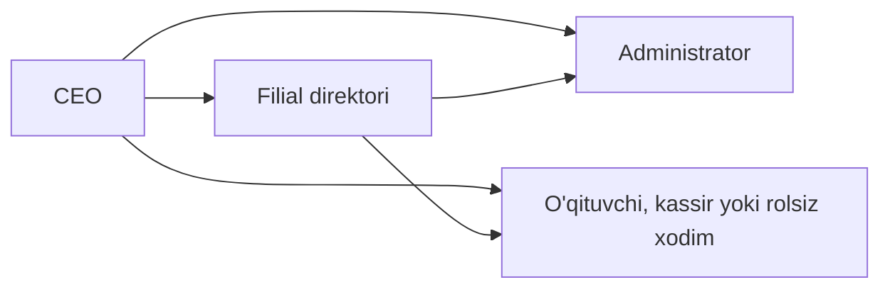

## Beshta rol

Tizimda beshta xodim roli bor. Rol xodim tizimda nima qila olishini belgilaydi.

| Rol | Nima qiladi | Qayerda ishlaydi |
|---|---|---|
| CEO | Butun tizimni boshqaradi. Xodimlar va rollarni belgilaydi, oylikni tasdiqlaydi, arxivni yuritadi. Davomat olinmagan dars uchun ustozga haq yozilishini faqat u hal qiladi. | Barcha filiallar |
| Filial direktori | O'z filialining rahbari: o'quvchi, guruh, xodim, moliya va hisobotlar bilan ishlaydi. Ba'zi amallar (masalan, oylikni tasdiqlash, arxiv) faqat CEO'da qoladi. | Faqat o'z filiali |
| Administrator | Kundalik ishni yuritadi: o'quvchi qo'shadi, guruhga yozadi, davomat oladi, darsni bekor qiladi yoki ko'chiradi, davomat olinmagan darsga «Dars bo'ldimi?» deb javob beradi, to'lov qabul qiladi. Xodim qo'sha olmaydi; «Ish haqi» va «Xarajatlar» sahifalari unga ko'rinmaydi. | Faqat o'z filiali (bir nechta bo'lishi mumkin) |
| O'qituvchi | O'z guruhlarini va jadvalini ko'radi, dars vaqtida davomat oladi, «Mening oyligim» sahifasida o'z oyligini ko'radi. | O'z guruhlari |
| Kassir | To'lov qabul qiladi va Moliya bo'limida qarzdorlar ro'yxatini ko'radi. «Guruhlar» sahifasi unga ochiq emas: guruh nomi unga havolasiz chiqadi. | O'z filiali |

Bitta xodimda bir nechta rol bo'lishi mumkin. Unda menyu va huquqlar hamma rolning yig'indisi bo'ladi.

<Eslatma tur="malumot">

Rollaringiz Profil sahifasida, birinchi rolingiz esa menyu pastida inglizcha nom bilan chiqadi: «CEO», «Branch Director», «Administrator», «Teacher» yoki «Cashier». Xodim formasida filial direktori «Direktor» deb yoziladi.

</Eslatma>

## Filial chegarasi

Har bir yozuv — o'quvchi, guruh, to'lov, xarajat, oylik — aniq bitta filialga tegishli. Bir filialda to'langan pul boshqa filialning qarzini yopmaydi.

- CEO barcha filiallarni ko'radi va boshqaradi; unga filial biriktirish shart emas.
- Filial direktori va administrator faqat o'ziga biriktirilgan filial(lar) ichida ishlaydi. Administratorni bir necha filialga biriktirish mumkin: u har birida mahalliy administrator kabi ishlaydi.
- Boshqa filialning yozuviga tegsangiz, tizim rad etadi, masalan: «Bu o'quvchi boshqa filialga tegishli — u bilan ishlash huquqingiz yo'q». Xabar matni yozuv turiga qarab farq qiladi.
- Yozuv sizning boshqa filialingizda bo'lsa-yu, tanlangan filialda ochilmasa, sahifa «Guruh boshqa filialda» (yoki «O'quvchi boshqa filialda») deb yozadi va shu filialga o'tish tugmasini beradi. Bu CEOga va bir nechta filialga biriktirilgan xodimga chiqadi.
- Filial tanlagichi (yuqori panel) faqat ko'rinishni toraytiradi, huquqni kengaytirmaydi. Batafsil — [Ekran tuzilishi](/qollanma/boshlash/interfeys).

Birorta ham filialga biriktirilmagan xodim tizimga kiradi, lekin oylik, kassa, qarzdorlar va Aloqa markazidagi ro'yxatlarni bo'sh ko'radi va hech narsa to'lay olmaydi. Bu ataylab shunday qilingan: bo'sh ekran ko'rsangiz, avval xodim filialga biriktirilganini tekshiring.

## Lavozim va rol

Lavozim va rol — ikki xil narsa.

- **Lavozim** — xodimning ish nomi, erkin yoziladi (masalan, farrosh, qorovul). U hech qanday huquq bermaydi.
- **Rol** — tizimdagi huquq. Uni xodim formasida «Tizim huquqi» maydonida tanlaysiz.

Xodim formasida «Lavozim» majburiy, «Tizim huquqi» esa ixtiyoriy. Rol berilmasa, xodim tizimga kira olmaydi: u faqat ro'yxatda turadi va oylik oladi.

- Rolsiz xodimga login yoki parol berib bo'lmaydi. Formadagi «Kirish ma'lumotlari» bo'limi faqat rol tanlanganda chiqadi.
- Xodimning oxirgi rolini olib tashlasangiz, tizim uning login va parolini o'zi o'chiradi.

## Kim kimga rol bera oladi

Rolni xodim formasida (Sozlamalar → «Xodimlar») tanlaysiz. Telegram ro'yxatdan o'tish havolasini yaratganda ham shu chegara amal qiladi. Siz faqat o'zingizdan pastdagi rollarni bera olasiz.

| Kim beradi | Qaysi rollarni bera oladi |
|---|---|
| CEO | CEO, filial direktori, administrator, o'qituvchi, kassir |
| Filial direktori | Administrator, o'qituvchi, kassir |

- Forma sizga faqat bera oladigan rollarni ko'rsatadi.
- Sizda bir nechta rol bo'lsa, rol berish chegarangizni eng yuqori rolingiz belgilaydi. Menyu va boshqa huquqlar esa hamma rolning yig'indisi.
- Xodimning hozirgi rollari ham sizning chegarangiz ichida bo'lishi kerak. Masalan, direktor boshqa direktorning yoki CEO'ning rollarini o'zgartira olmaydi: unda rollar ro'yxati faqat o'qish uchun chiqadi.
- O'z rollaringizni faqat CEO o'zgartiradi. Formani rollarni o'zgartirmasdan saqlash rol berish hisoblanmaydi.
- Administrator xodimlar formasini ochmaydi, shuning uchun rol bera olmaydi.

## Kim kimning hisobini o'zgartiradi

Boshqa xodimning hisobidagi hamma narsani — ism, telefon, parol, holat, filial, arxivlash — faqat undan yuqoridagi rahbar o'zgartiradi.

| Kim | Kimning hisobini o'zgartira oladi |
|---|---|
| CEO | Hammaniki |
| Filial direktori | O'z filialidagi administrator, o'qituvchi, kassir va rolsiz xodimniki |
| Administrator, o'qituvchi, kassir | Hech kimniki (faqat o'z profilini) |

Strelka: shu hisobni o'zgartira oladi degani. Direktor buni faqat o'z filialida qiladi.

- Tengdoshingiz yoki sizdan yuqoridagining hisobini faqat CEO o'zgartiradi. Masalan, boshqa direktorning hisobini direktor o'zgartira olmaydi.
- Bir nechta roli bor xodimda har bir roli sizning chegarangiz ichida bo'lishi kerak. Shuning uchun dars ham beradigan direktorni faqat CEO tahrirlaydi.
- Hisobning hamma maydoni himoyalangan, telefon ham: Telegram orqali kirish uni parolsiz qidiradi.
- CEO'dan boshqa hech kim o'z holatini o'zgartira olmaydi va o'zini arxivlay olmaydi.
- Rad etilsa, «Bu xodim sizdan yuqori yoki siz bilan bir darajada — uning hisobini faqat sizdan yuqori rahbar o'zgartiradi» chiqadi.

## Bloklangan xodim

Xodim formasidagi «Xodim holati» maydonida «Faol», «Nofaol», «To'xtatilgan» va «Ishdan bo'shatilgan» bor. Arxivlash alohida: «Xodimlar» va «O'qituvchilar» ro'yxatida qator menyusidagi «O'chirish» xodimni arxivga o'tkazadi.

- To'xtatilgan, ishdan bo'shatilgan yoki arxivlangan xodim bloklanadi. «Nofaol» xodim bloklanmaydi.
- Bloklangan xodim yangidan kira olmaydi. Ochiq turgan oynasida u keyingi harakatidayoq to'xtaydi: «Hisobingiz bloklangan» xabari chiqadi va hech narsa ochilmaydi.
- Xodimni to'xtatish yoki arxivlashni «Xodimlar» sahifasida qilasizmi yoki «O'qituvchilar» sahifasidami — farqi yo'q.
- Bloklangan xodim hisob ochib bera olmaydi, rol bera olmaydi va Telegram ro'yxatdan o'tish havolasini yarata olmaydi.
- Arxivdan tiklangan xodim yana kira oladi.

Xodimni darhol to'xtatish kerak bo'lsa, uni «To'xtatilgan» qiling yoki arxivlang.

## Misol

A filialida direktor Aziza, administrator Bobur va o'qituvchi Dilnoza ishlaydi. B filialining direktori — Sardor. Malika farrosh bo'lib ishlaydi.

- Aziza yangi xodim qo'shganda «Tizim huquqi» maydonida faqat «Administrator», «O'qituvchi» va «Kassir» ni ko'radi. «Direktor» va «CEO» ro'yxatda yo'q.
- Aziza Boburning telefon raqamini yoki holatini o'zgartira oladi: administrator Azizadan pastda.
- Bobur Dilnozaning hisobini o'zgartira olmaydi: administrator hech kimning hisobiga tegmaydi. Buni Aziza qiladi.
- Aziza Sardorning hisobini o'zgartira olmaydi: Sardor boshqa filialda va Azizaga tengdosh. Buni faqat CEO qiladi.
- Malikaning lavozimi — farrosh, roli yo'q. U oylik oladi, lekin tizimga kira olmaydi; unga login va parol berib bo'lmaydi.
- Aziza Dilnozani «To'xtatilgan» qilsa, Dilnoza ochiq turgan oynasida keyingi harakatidayoq «Hisobingiz bloklangan» xabarini ko'radi.

## Istisnolar

- Menyu va qidiruv rolga qarab ko'rsatadi, lekin bu xavfsizlik chegarasi emas. Menyuda yo'q sahifani havola bilan ochib qo'ysangiz ham, huquqingiz bo'lmagan amalni tizim rad etadi: «Sizga bu amalni bajarishga ruxsat yo'q».
- O'quvchi — alohida rol. Uni xodim hisobiga berib bo'lmaydi. Bir odam ham xodim, ham o'quvchi bo'lsa, unda ikkita hisob bo'ladi ([Tizimga kirish va parol](/qollanma/boshlash/tizimga-kirish) sahifasiga qarang).
- Rol o'zgarishi kechikadi: pasaytirilgan xodim 1 soatgacha eski rolining oddiy sahifalarini ko'rishi mumkin, lekin yangi darajasidan yuqori hisob yoki havola yarata olmaydi. Bloklash esa darhol ishlaydi.

## Kim qila oladi

«Ha» — ekranda tugma yoki sahifa bor va tizim amalni qabul qiladi. «—» — ekranda yo'q va tizim rad etadi. Filial direktori va administrator faqat o'z filiali ichida ishlaydi.

| Amal | CEO | Filial direktori | Administrator | O'qituvchi | Kassir |
|---|---|---|---|---|---|
| To'lov qayd qilish (Moliya sahifalaridagi «To'lov qayd qilish» tugmasi yoki o'quvchi profilidagi «To'lov qo'shish») | Ha | Ha | Ha | — | Ha |
| To'lov summasi yoki usulini tuzatish («Summani to'g'rilash»; faqat qo'lda kiritilgan to'lov, dars paketida summa to'lovdan keyin dars puli yechilmagan bo'lsagina o'zgaradi) | Ha, istalgan vaqt | Ha, 72 soat ichida | Ha, 72 soat ichida | — | — |
| Qarzdorlar ro'yxatini ko'rish (Moliya → Qarzdorlik → «Qarzdorlar») | Ha | Ha | Ha | — | Ha |
| Qo'ng'iroq natijasini kiritish (Qarzdorlik qatoridagi «Natijani kiritish» yoki Aloqa markazi) | Ha | Ha | Ha | — | — |
| Pulni qaytarish (o'quvchi profilidagi «To'lov» menyusi; «Muzlatilgan puli» tabida «O'quvchiga qaytarish») | Ha | Ha | Ha | — | — |
| Balansdan pulni yechib olish (profildagi «Yechib olish»; «Muzlatilgan puli» tabida «Markaz hisobiga o'tkazish») | Ha | Ha | Ha | — | — |
| Boshlang'ich balans kiritish (profildagi «To'lov» → «Boshlang'ich balans»; har o'quvchiga bir marta, keyin o'zgartirilmaydi) | Ha | — | — | — | — |
| Xarajat kiritish, tahrirlash, o'chirish | Ha | Ha | — | — | — |
| «Ish haqi» sahifasini ko'rish (Moliya → «Ish haqi») | Ha | Ha | — | — | — |
| Oylikni tasdiqlash | Ha | — | — | — | — |
| Oylikni to'lash | Ha | Ha | — | — | — |
| O'quvchi qo'shish va tahrirlash | Ha | Ha | Ha | — | — |
| O'quvchini guruhga qo'shish | Ha | Ha | Ha | — | — |
| O'quvchini guruhdan chiqarish (profildagi guruh kartasida «Chiqarish») | Ha | Ha | Ha | — | — |
| O'quvchi holatini o'zgartirish | Ha | Ha | Ha | — | — |
| O'quvchini arxivga o'tkazish | Ha | Ha | Ha | — | — |
| «Guruhlar» sahifasini ochish | Ha | Ha | Ha | Ha, faqat o'z guruhlari | — |
| Guruh yaratish, tahrirlash, o'chirish | Ha | Ha | Ha | — | — |
| Yangi davomat olish (dars boshlanishidan oldin, odatda 10 daqiqa, dars tugaguncha) | Ha | Ha | Ha | Ha, faqat o'z guruhida, dars kuni va bitta marta | — |
| Olingan davomatni tuzatish (dars tugagandan keyin ham) | Ha | Ha | Ha | — | — |
| Davomat olinmagan darsga «Dars bo'ldimi?» deb javob berish («Bo'ldi», «Bo'lmadi») | Ha | Ha | Ha, topshiriqni boshqa administrator olmagan bo'lsa | — | — |
| Davomat olinmagan dars uchun ustozga haq yozdirish («Ustoz aybdor emas — haq yozilsin») | Ha | — | — | — | — |
| Darsni bekor qilish yoki boshqa kunga ko'chirish | Ha | Ha | Ha | — | — |
| Bekor qilingan yoki ko'chirilgan dars yozuvini o'chirish | Ha | Ha | — | — | — |
| Bayram (dam olish kuni) qo'shish | Ha | Ha | Ha | — | — |
| Izoh yozish | Ha | Ha | Ha | — | — |
| Izoh yoki topshiriqni o'chirish (tizim topshirig'idan tashqari) | Ha | — | — | — | — |
| O'zgarishlar tarixini («Tarix») ko'rish | Ha | Ha | Ha | — | — |
| O'qituvchilar ro'yxatini ko'rish | Ha | Ha | Ha | — | — |
| O'qituvchi qo'shish va tahrirlash | Ha | Ha | — | — | — |
| Xodim qo'shish va tahrirlash (Sozlamalar → «Xodimlar») | Ha | Ha | — | — | — |
| Filial ma'lumotini o'zgartirish va holatini almashtirish | Ha | Ha, faqat o'z filialida | — | — | — |
| Arxivni ko'rish va tiklash | Ha | — | — | — | — |

Jadvalga faqat ekran va tizim bir xil javob beradigan amallar kiritilgan: tugma bor bo'lsa, tizim ham qabul qiladi; tugma yo'q bo'lsa, tizim ham rad etadi. Bitta istisno bor, u pastda yozilgan. Boshqa amallar tegishli bo'lim sahifalarida yoziladi.

Istisno: «Summani to'g'rilash» ekranda to'lovning turiga qaramay ko'rinadi, ammo tizim onlayn (Payme, Click) to'lovni rad etadi. Dars paketi kursida to'lovdan keyin dars puli yechilgan bo'lsa, qo'lda kiritilgan to'lovning ham summasini o'zgartirib bo'lmaydi; usulini esa o'zgartirish mumkin. Oylik kursda bu cheklov yo'q.

Davomat vaqti hamma rol uchun bir xil, CEO uchun ham: yangi davomat faqat dars vaqtida olinadi. «Davomat dars boshlanishidan necha daqiqa oldin ochiladi» sozlamasini CEO Sozlamalar → «To'lov» da o'zgartiradi (0 dan 60 gacha, odatda 10). Dars tugagach yangi davomatni faqat «Dars bo'ldimi?» savoli ochilgan bo'lsa, unga «Bo'ldi» deb javob berib kiritasiz; shunda ustozga bu dars uchun haq yozilmaydi.

## Tizimda qayerda

- Sozlamalar → [Xodimlar](/settings/employees) — xodim qo'shish, lavozim, rol va holat. Menyuda faqat CEO va filial direktoriga ko'rinadi.
- [O'qituvchilar](/teachers) — o'qituvchi hisobi: qator menyusidagi «Status o'zgartirish» va «O'chirish» (arxivga o'tkazadi).
- [Profil](/profile) — o'z ma'lumotlaringiz va rolingiz.
- Chap menyu rolingizga qarab ochiladi: [Ekran tuzilishi](/qollanma/boshlash/interfeys) sahifasiga qarang.
