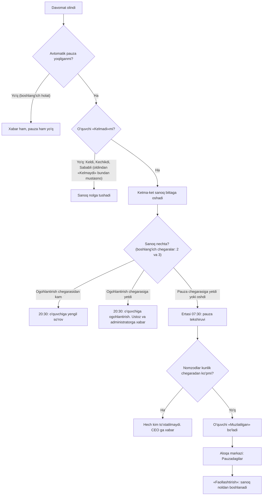

## Qanday ishlaydi

Kelmay qo'ygan o'quvchining har darsi ham hisoblanadi: ustozga ulush yoziladi, o'quvchi to'lamagan bo'lsa ustozga markaz o'z hisobidan to'laydi. Avtomatik pauza shu oqimni to'xtatadi. Tizim ketma-ket sababsiz dars qoldirgan o'quvchini o'zi «Muzlatilgan» holatiga o'tkazadi va davomat ro'yxatidan chiqaradi. Guruhdan chiqarmaydi: qaytish bir tugma bilan bo'ladi.

## Sanoq: nima sanaladi

Tizim o'quvchining ketma-ket «Kelmadi» darslarini eng oxirgisidan boshlab sanaydi. Bu ketma-ketlikni zanjir deb ataymiz.

- «Keldi», «Kechikdi» va «Sababli» zanjirni uzadi: sanoq noldan boshlanadi (oldindan «Kelmaydi» deb aytilgan dars bundan mustasno, keyingi band).
- Oldindan «Kelmaydi» (sababsiz) deb aytilgan dars davomatda «Sababli» bo'lib tushsa ham, «Kelmadi» sifatida sanaladi. Oldindan «Sababli» (masalan, kasallik) aytilgan dars esa zanjirni uzadi. Batafsil — [Oldindan belgilash](/qollanma/davomat/oldindan-belgilash).
- Markaz bekor qilgan dars sanoqda ko'rinmaydi: zanjirni na uzadi, na oshiradi.
- Davomat olinmagan dars sanoqqa kirmaydi.
- Sanoq faqat «Faol» guruhdagi faol yozilish uchun yuritiladi.
- Sanoq o'quvchi guruhga qo'shilgan yoki oxirgi marta faollashtirilgan kundan boshlanadi: undan oldingi davomat hisobga olinmaydi. Shuning uchun faollashtirilgan o'quvchi ertasiga qayta pauzaga tushmaydi, shu guruhga qayta yozilgan o'quvchi esa eski qoldirishlarni meros olmaydi.

## Uch bosqich va vaqt

Chegaralar boshlang'ich qiymatlar bilan berilgan (CEO o'zgartiradi).

| Bosqich | Qachon | Nima bo'ladi |
|---|---|---|
| 1-bosqich | 1 ta dars qoldirilgan (ogohlantirish chegarasidan kam) | O'quvchiga Telegramda yengil so'rov boradi. Bugungi dars uchun «Bugun darsda ko'rinmadingiz» deb yoziladi. Xodimlarga xabar bormaydi. |
| 2-bosqich | 2 ta ketma-ket (ogohlantirish chegarasi) | O'quvchiga ogohlantirish boradi: yana nechta dars qoldirilsa, joyi vaqtincha to'xtatilishi yoziladi. Guruhning ustozlari va filial administratorlariga «Dars qoldirish ogohlantirishi» bildirishnomasi keladi. |
| 3-bosqich | 3 ta ketma-ket (pauza chegarasi) | O'quvchi «Muzlatilgan» qilinadi. Unga «Vaqtincha to'xtatib turdik» xabari boradi; ustozlar va filial administratorlariga «Avtomatik pauza» bildirishnomasi keladi. |

- **20:30** — 1- va 2-bosqich xabarlari, dars kuni kechqurun (24.09.2026 dan; ilgari ular ertasi ertalab ketardi).
- **07:30** — pauza, ertasi ertalab: uchinchi «Kelmadi» qo'yilgan kundan keyingi ertalab. Shu vaqtda 20:30 dan keyin kiritilgan davomat uchun 1- va 2-bosqich xabarlari ham yuboriladi. Bu paytda 1-bosqich xabari «Bugun» o'rniga dars sanasini yozadi («12.09.2026 dagi darsda ko'rinmadingiz» kabi).
- Tizim har kuni ishlaydi: yakshanba va bayramda ham. Bir qoldirish — bir xabar: xabar takrorlanmaydi. Davomat olinmagan kun sanoqni o'zgartirmaydi, lekin kech kiritilgan davomat tuzatishlari ham shu tekshiruvda hisobga olinadi.
- O'quvchiga xabar Telegramda boradi. Telegram ulanmagan o'quvchiga xabar bormaydi, lekin pauza baribir qo'llanadi.

## Kunlik chegara

Bir ertalabki tekshiruvda pauzaga nomzod o'quvchilar soni «Bir kunda ko'pi bilan» chegarasidan ko'p bo'lsa, hech kim pauzaga tushmaydi. Barcha CEO ga «Avtomatik pauza» bildirishnomasi boradi: nechta nomzod topilgani, chegara qancha ekani va hech kim pauza qilinmagani yoziladi.

- Birinchi bir nechtasini tanlab pauza qilinmaydi: qaysilari ekani tasodifiy bo'lardi.
- Ogohlantirish xabarlari chegaraga bog'liq emas: ular baribir yuboriladi.
- Ertasi ertalab tizim yana tekshiradi.
- Pauza yozilmay qolsa (xatolik), CEO ga xabar boradi.
- Bu himoya davomat noto'g'ri kiritilgan kunda yuzlab o'quvchi bir kechada muzlab qolmasligi uchun. Bildirishnoma davomat ma'lumotini tekshirishni yoki chegarani oshirishni so'raydi.

## Sozlama

Sozlamalar → «Avtomatik pauza» sahifasida:

| Maydon | Nima qiladi | Boshlang'ich qiymat | Mumkin qiymatlar |
|---|---|---|---|
| «Avtomatik pauza yoqilgan» | Yoqadi yoki o'chiradi. O'chiq bo'lsa, xabar ham, pauza ham yo'q. | O'chiq | — |
| «Ogohlantirish» | Shuncha dars qoldirilganda o'quvchiga Telegram xabar ketadi. | 2 | 1 dan 10 gacha |
| «Pauza» | Shuncha dars qoldirilganda o'quvchi pauzaga o'tkaziladi. | 3 | 2 dan 20 gacha |
| «Bir kunda ko'pi bilan» | Shunchadan ko'p nomzod topilsa, hech kim pauza qilinmaydi va CEO ga xabar keladi. | 10 | 1 dan 100 gacha |

- O'zgartirgach «Saqlash» ni bosing. Ogohlantirish chegarasi pauza chegarasidan kichik bo'lishi kerak.
- Sozlamani faqat CEO o'zgartiradi: yoqadi, o'chiradi, chegaralarni qo'yadi. Bu dasturchisiz, sahifadan qilinadi. Filial direktori sahifani ko'radi, o'zgartira olmaydi. Sozlama butun markaz uchun bitta, filial bo'yicha alohida emas.
- Chegara o'zgarsa, «Aloqa markazi»dagi «Ko'p dars qoldirganlar» ro'yxati ham darhol unga o'tadi.
- «Pauza» maydoniga 20 gacha yozish mumkin, lekin tizim har o'quvchining oxirgi 10 ta davomatini ko'radi: 10 dan katta chegarada hech kim pauzaga tushmaydi.

## Pauzaga tushgach

- Pauza — o'quvchi darajasidagi oddiy muzlatish. O'quvchi «Muzlatilgan» bo'ladi, davomat ro'yxatidan chiqadi va ustozga uning nomidan ulush yozilmaydi. Pul qoidalari muzlatishdagi bilan bir xil: [Muzlatish va qaytarish](/qollanma/oquvchilar/muzlatish). Mavjud qarzi yo'qolmaydi.
- Pauza tizim nomidan yoziladi. Sabab «Avtomatik pauza:» bilan boshlanadi va nechta dars qoldirilgani hamda oxirgi sanasi yoziladi. Uni «Pauzadagilar» tabining «Sabab» ustunida va o'quvchi qatoridagi «Status tarixi»da ko'rasiz.
- Pauzadagi o'quvchi davomat ro'yxatida yo'q, shuning uchun uning o'tgan davomatini tuzatish uchun avval uni «Faollashtirish» kerak.
- «Faol o'quvchi» soni pauzadagilar hisobiga kamayadi.

## Aloqa markazi

Chap menyudan «Aloqa markazi» ni oching.

**«Pauzadagilar»** tabi tizim pauzaga tushirgan o'quvchilarni ko'rsatadi. Qo'lda muzlatilgan o'quvchilar bu yerda chiqmaydi: tab sababi «Avtomatik pauza:» bilan boshlangan muzlatilganlarni tanlaydi. Jadval ustunlari: «O'quvchi», «Telefon», «Guruh / kurs», «Pauza sanasi», «Sabab», «Balans», «Amal». Ro'yxat bo'sh bo'lsa, «Avtomatik pauzaga tushgan o'quvchi yo'q.» yoziladi.

«Amal» ustunida ikki tugma bor:

- **«Qo'ng'iroq»** — o'quvchiga qo'ng'iroqni qayd qilish oynasini ochadi.
- **«Faollashtirish»** — tasdiq oynasi ochiladi: o'quvchi guruh ro'yxatiga qaytadi va darslari uchun yana hisob yozila boshlaydi; ketma-ket qoldirish sanog'i noldan boshlanadi. Sabab so'ralmaydi. Tasdiqlagach «O'quvchi faollashtirildi» xabari chiqadi va o'quvchi ro'yxatdan ketadi.

**«Ko'p dars qoldirganlar»** tabi ogohlantirish chegarasiga yetgan o'quvchilarni ko'rsatadi:

- «Ketma-ket kelmagan» ustunida qoldirilgan darslar soni turadi.
- «Pauzagacha» ustunida «N ta dars» yoki pauza chegarasiga yetganlar uchun «Pauza yoqasida» turadi. «Pauza yoqasida» ertasi ertalab pauza bo'lishini kafolatlamaydi: o'quvchi faqat sozlama yoqilgan va kunlik chegara oshmagan bo'lsa pauzaga tushadi. Ro'yxat sozlama o'chiq bo'lsa ham xuddi shunday tuziladi.
- «Ogohlantirildi» belgisi bir o'quvchiga ikki marta qo'ng'iroq qilmaslik uchun. Undagi sana — oxirgi xabar qaysi qoldirilgan dars haqida ketgani (dars sanasi), xabar yuborilgan kun emas. Belgi 1-bosqich (yengil so'rov) va 2-bosqich (ogohlantirish) xabarlaridan keyin chiqadi va Telegram ulanmagan (xabar yetib bormagan) o'quvchida ham turadi.

## Misol

Sozlama yoqilgan, chegaralar boshlang'ich qiymatda: ogohlantirish 2, pauza 3. Jasur soxta ism, Telegrami ulangan.

1. **1-dars.** Jasur «Kelmadi». Kechqurun 20:30 da unga Telegramda «Bugun darsda ko'rinmadingiz» xabari boradi. Ustoz va administratorga xabar bormaydi.
2. **2-dars.** Jasur yana «Kelmadi»: sanoq 2 ta. 20:30 da unga ogohlantirish boradi: yana 1 ta dars qoldirilsa, joyi vaqtincha to'xtatiladi. Ustoz va filial administratorlariga «Dars qoldirish ogohlantirishi» keladi. «Ko'p dars qoldirganlar» tabida Jasurning «Pauzagacha» ustunida «1 ta dars» va «Ogohlantirildi» belgisi turadi.
3. **3-dars.** Jasur «Kelmadi»: sanoq 3 ta. Ertasi ertalab 07:30 da tizim uni «Muzlatilgan» qiladi. Jasurga «Vaqtincha to'xtatib turdik» xabari boradi, ustoz va administratorlarga «Avtomatik pauza» bildirishnomasi keladi. Jasur «Pauzadagilar» tabida turadi.
4. Jasur qaytmoqchi. Administrator uning qatorida «Faollashtirish» ni bosadi va tasdiqlaydi. Jasur guruh ro'yxatiga qaytadi, sanoq noldan boshlanadi.

Agar 3-darsda Jasur «Keldi», «Kechikdi» yoki «Sababli» bo'lganida (va oldindan «Kelmaydi» deb aytmagan bo'lsa), sanoq nolga tushardi va pauza bo'lmasdi.

## Istisnolar

- Sanoq 07:30 dagi joriy davomatdan hisoblanadi. Shu paytgacha «Kelmadi» boshqa belgiga o'zgartirilgan bo'lsa, pauza bo'lmaydi.
- Pauza faqat hali «Faol» o'quvchiga qo'llanadi. Tekshiruv bilan pauza orasida administrator o'quvchi holatini o'zgartirgan bo'lsa, tizim uni jimgina o'tkazib yuboradi.
- Tizim faqat «Faol» holatdan «Muzlatilgan»ga o'tkazadi: o'quvchini chetlatmaydi va arxivga tushirmaydi.

## Kim qila oladi

«Ha» — ekranda tugma bor va tizim amalni qabul qiladi. «—» — ekranda yo'q yoki tizim rad etadi. Filial direktori va administrator faqat o'z filialida ishlaydi.

| Amal | CEO | Filial direktori | Administrator |
|---|---|---|---|
| Avtomatik pauzani yoqish, o'chirish, chegaralarni o'zgartirish | Ha | — | — |
| Sozlamalar → «Avtomatik pauza» sahifasini ko'rish | Ha | Ha | — |
| «Pauzadagilar» va «Ko'p dars qoldirganlar» tablarini ko'rish | Ha | Ha | Ha |
| «Faollashtirish» | Ha | Ha | Ha |
| Kunlik chegara oshgani haqida xabar olish | Ha | — | — |

Ogohlantirish va pauza haqidagi bildirishnomani guruhning filial administratorlari va ustozlari oladi. CEO va filial direktoriga bunday bildirishnoma bormaydi (o'zi shu guruhning ustozi yoki administrator roli ham bor bo'lsa — boradi).

## Tizimda qayerda

- Sozlamalar → «Avtomatik pauza» (CEO va filial direktoriga ko'rinadi). Sahifadagi «Pauzadagilarni ko'rish» tugmasi «Aloqa markazi»ning «Pauzadagilar» tabini ochadi.
- «Aloqa markazi» → «Pauzadagilar» va «Ko'p dars qoldirganlar» (CEO, filial direktori, administrator).
- Pauza oddiy muzlatish bo'lgani uchun uning qoidalari — [Muzlatish va qaytarish](/qollanma/oquvchilar/muzlatish).
- Xodimga keladigan davomat xabarlari — [Davomat eslatmalari](/qollanma/davomat/eslatmalar).
