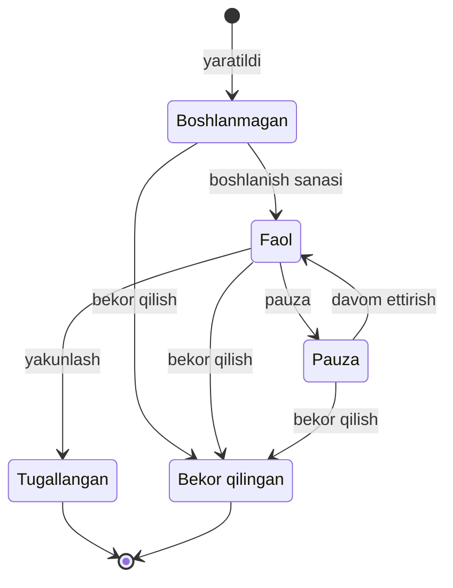

## Holatlar va o'tishlar

Guruh beshta holatdan birida turadi. Holatni «Status o'zgartirish» amali bilan o'zgartirasiz. Tizim o'zi faqat «Boshlanmagan» guruhni «Faol» qiladi (boshlanish sanasi kelganda). Guruhlar filial holatiga qarab ham o'zgaradi: pastdagi Filial holati bo'limiga qarang.

Strelka shu holatdan bunga o'tish mumkinligini bildiradi. «Tugallangan» va «Bekor qilingan» — oxirgi holatlar: ulardan boshqa holatga qaytib bo'lmaydi.

| Holat | Nimani bildiradi | Qanday bo'ladi |
|---|---|---|
| «Boshlanmagan» | Guruh hali boshlanmagan. O'quvchi qo'shish mumkin, davomat olib bo'lmaydi | Yangi guruh shunday ochiladi |
| «Faol» | Guruh o'qiydi: davomat olinadi, oylik hisob yoziladi | Boshlanish sanasi kelganda tizim o'zi; yoki siz «Boshlanmagan» va «Pauza» dan |
| «Pauza» | Guruh vaqtincha to'xtagan, o'quvchilar guruhda qoladi | Siz «Faol» dan; yoki filial «Nofaol» qilinganda |
| «Tugallangan» | Guruh o'qishni tugatgan | Siz «Faol» dan |
| «Bekor qilingan» | Guruh to'xtatilgan | Siz «Boshlanmagan», «Faol» va «Pauza» dan; yoki filial yopilganda |

- «Boshlanmagan» guruhni tizim har kecha 00:05 da (Toshkent vaqti) tekshiradi va boshlanish sanasi kelgan yoki o'tib ketganini «Faol» qiladi. Boshlanish sanasi kiritilmagan guruh o'zi «Faol» bo'lmaydi ([Guruh yaratish](/qollanma/guruhlar/guruh-yaratish)).
- Tugash sanasi kelganda guruh o'zi yopilmaydi: yakunlashni qo'lda qilasiz (14.07.2026 dan).

## Holat nomlari ekranlarda

Bir holat ekranga qarab har xil yoziladi. «To'xtatilgan» ikki xil holatni bildirishi mumkin.

| Holat | Ro'yxatda, «Status tarixi»da va «Tarix» tabida | Guruh sahifasidagi kartada | «Statusni o'zgartirish» oynasidagi tanlov kartochkasida | «Davomat» tabidagi «Guruh faol emas» xabarida |
|---|---|---|---|---|
| Boshlanmagan | Boshlanmagan | Boshlanmagan | tanlab bo'lmaydi | Shakllanmoqda |
| Faol | Faol | Faol | Faol | xabar chiqmaydi |
| Pauza | Pauza | Pauza | Pauza | To'xtatilgan |
| Tugallangan | Tugallangan | Yakunlangan | Tugallangan | Tugallangan |
| Bekor qilingan | To'xtatilgan | Bekor qilingan | Bekor qilingan | Bekor qilingan |

Bu qo'llanmada holat oynadagi nom bilan yoziladi: «Bekor qilingan», «Tugallangan». Oynaning «Hozirgi:» qatori esa ro'yxatdagi nomni ko'rsatadi: bekor qilingan guruh uchun «To'xtatilgan».

Guruhlar ro'yxatining tepasida «Jami», «Faol», «Boshlanmagan», «Pauza» va «Tugallangan» kartalari turadi; «Barcha holatlar» filtrida ham shu to'rt holat bor. Bekor qilingan guruh ro'yxatda «To'xtatilgan» belgisi bilan turaveradi, lekin uning alohida kartasi ham, filtri ham yo'q; «Jami» uni ham sanaydi. «Pauza» kartasining izohi «To'xtatilgan guruhlar» deb yozilgan.

## Holatni o'zgartirish

1. [Guruhlar](/groups) ro'yxatida qator oxiridagi «Amallar» tugmasini bosib «Status o'zgartirish» ni tanlang, yoki guruh sahifasidagi kartada «Status o'zgartirish» ni bosing.
2. «Statusni o'zgartirish» oynasida «Hozirgi:» holat turadi. «Yangi statusni tanlang» ostidan kartochkani tanlang: faqat ruxsat etilgan o'tishlar ko'rinadi.
3. «Sabab» ni yozing. «Faol», «Pauza» va «Bekor qilingan» uchun sabab majburiy; «Tugallangan» da sabab so'ralmaydi.
4. «O'zgartirish» ni bosing. «Status muvaffaqiyatli o'zgartirildi» xabari chiqadi.

Oyna o'quvchilarga nima bo'lishini oldindan ko'rsatmaydi: ta'sirini shu sahifaning pastki qismidan o'qing.

«Tugallangan» yoki «Bekor qilingan» guruhda oynada «Bu statusdan boshqa statusga o'tish mumkin emas» yoziladi va faqat «Yopish» tugmasi bor.

O'tishlar tarixi: qator menyusidagi «Status tarixi» («Sana», «Kim», «Oldingi», «Yangi», «Sabab») va guruh sahifasi → «Tarix» tabi → «Guruh o'zgarishlari».

### Yo hammasi, yo hech narsa

Holatni o'zgartirish bir butun amal: guruh holati, o'quvchilarni chiqarish, pulni qaytarish, tarix yozuvlari va avtomatik bitirish birga bajariladi. Biror qadam yiqilsa (masalan, bitta o'quvchiga pul qaytarilmasa), hech narsa o'zgarmaydi: guruh oldingi holatida qoladi va «Guruh holati o'zgarmadi, hech narsa saqlanmadi. Qayta urinib ko'ring.» xabari chiqadi. Ikki kishi bir vaqtda o'zgartirsa, ikkinchisi xato oladi.

Amal 60 soniyagacha davom etishi mumkin. Shu paytda guruh o'quvchilariga davomat yoki to'lov kiritish kutib qolishi yoki xato bilan qaytishi mumkin.

## Holat o'zgarganda nima bo'ladi

### «Faol»

O'quvchilarga va pulga tegilmaydi. «Pauza»dan qaytgan guruhga oylik hisob yozilmagan bo'lsa, tizim uni o'zi yozadi ([Oylik to'lov](/qollanma/tolovlar/oylik-tolov)).

### «Pauza»

O'quvchilar va pulga tegilmaydi: o'quvchilar guruhda qoladi. Lekin:

- Davomat olib bo'lmaydi: «Davomat» tabida «Guruh faol emas (...). Davomat olish mumkin emas.» yoziladi.
- Oylik hisob yozilmaydi, davomat eslatmalari yuborilmaydi va tugagan darsga «Dars bo'ldimi?» savoli ochilmaydi (savol faqat «Faol» guruhlarga beriladi).
- Guruh kunlik [Jadval](/qollanma/guruhlar/jadval)da chiqmaydi.
- Guruh xona va ustozning vaqtini band qilmaydi: guruh formasi shu vaqtga boshqa guruhni qo'yishga to'sqinlik qilmaydi.
- «Pauza»dagi guruhning o'quvchilari faol o'quvchi hisobiga kirmaydi ([O'quvchining hayot davri](/qollanma/oquvchilar/hayot-davri)).

### «Tugallangan»

- **Faol o'quvchilar.** Yozilishi «Tugallangan» bo'ladi. Boshqa guruhda yozilishi ochiq («Faol») qolmagan o'quvchi avtomatik «Bitirgan» bo'ladi (tarixida sabab: «Avtomatik: guruh tugallanganligi sababli»). Boshqa guruhda yozilishi ochiq turgan o'quvchi bitirmaydi, u guruh «Pauza» yoki «Boshlanmagan» holatida bo'lsa ham.
- **Muzlatilgan o'quvchilar.** Bitirmaydi: yozilishi «Chiqdi» bo'ladi, ya'ni guruhdan chiqarilgan hisoblanadi. Ular kursni tugatmagan.
- **Pul.** O'tilmagan darslar puli balansga qaytadi: dars paketida oldindan to'langan o'tilmagan darslar, oylik kursda oyning o'tilmagan darslari. Shartnoma 6.2 (40% qoidasi) bunga tegmaydi ([Guruhdan chiqarish va pul](/qollanma/oquvchilar/guruhdan-chiqarish)). Muzlatilgan o'quvchida odatda qaytadigan pul yo'q: muzlatishda u allaqachon qaytgan.
- Guruhning tugash sanasiga tegilmaydi.

### «Bekor qilingan»

- **Faol va muzlatilgan o'quvchilar** guruhdan chiqariladi: yozilishlari «Chiqdi» bo'ladi. O'quvchining o'z holati («Faol», «Muzlatilgan») o'zgarmaydi. Boshqa faol guruhi bo'lmagan «Faol» o'quvchi «Guruhlashtirilmagan» ro'yxatiga tushadi.
- **Pul.** Yuqoridagidek: o'tilmagan darslar puli balansga qaytadi, 40% qoidasi tegmaydi.

Har chiqarish o'quvchi kartasining «Tarix» tabida «Guruhdan chiqarildi», guruhning «Tarix» tabida esa «O'quvchi chiqarildi» yozuvi bo'lib qoladi. «Sabab» qatorida: «Guruh to'xtatildi» (bekor qilinganda), «Guruh tugallandi, o'quvchi muzlatilgan edi» (tugallanganda muzlatilgan o'quvchi uchun) yoki «Guruh o'chirildi» (o'chirishda yozgan sababingiz shundan keyin qo'shiladi). Chiqarilgan o'quvchi ketgan hisoblanadimi — [Lug'at](/qollanma/boshlash/lugat), «Ketgan o'quvchi». Yopilgan guruhga o'quvchi qo'shib bo'lmaydi ([Guruhga qo'shish va o'tkazish](/qollanma/oquvchilar/guruhga-qoshish)).

### Filial holati

Guruhlar filial holatiga ham bog'liq (Sozlamalar → «Filiallar»):

- Filial «Yopilgan» qilinsa, uning hamma guruhi «Bekor qilingan» bo'ladi (tugallanganlari ham), o'quvchilari chiqariladi, xonalari «Arxivlangan» holatiga o'tadi.
- Filial «Nofaol» qilinsa, «Faol» guruhlari «Pauza» ga o'tadi. Filial qayta «Faol» bo'lganda guruhlar o'zi qaytmaydi: har birini o'zingiz «Faol» qilasiz.
- Filial o'zgarishi guruh holati kabi yo hammasi, yo hech narsa tarzida ishlamaydi: har o'quvchining puli alohida qaytariladi, bittasi yiqilsa qolganlari davom etadi.

## Guruhni o'chirish

«O'chirish» guruhni arxivga o'tkazadi: u ro'yxatdan yo'qoladi. Arxivni faqat CEO ko'radi.

1. Ro'yxatdagi qator menyusida «Amallar» → «O'chirish» ni bosing. Sarlavhasi «#014» guruhini o'chirasizmi? kabi oyna ochiladi.
2. Oyna guruhdan nechta o'quvchi chiqishini ko'rsatadi: «Guruhda hali 21 ta o'quvchi bor (1 tasi muzlatilgan).» Faqat muzlatilgan bo'lsa — «Guruhda hali N ta muzlatilgan o'quvchi bor.» Hech kim bo'lmasa — «Guruhda o'quvchi yo'q. Guruh arxivga o'tkaziladi.»
3. Sababni yozing («Sabab yozing (ixtiyoriy)...», 500 belgigacha).
4. «O'chirish» ni bosing. «Guruh o'chirildi, 21 ta o'quvchi guruhdan chiqarildi» xabari chiqadi.

Nima bo'ladi:

- Faol va muzlatilgan o'quvchilar guruhdan chiqariladi, ishlatilmagan darslari puli balansga qaytadi (oyna shunday deydi). Pul qoidasi «Bekor qilingan»dagi bilan bir xil.
- Ro'yxatdagi «O'quvchilar» ustuni faqat faol o'quvchilarni sanaydi. Oyna muzlatilganlarni ham sanaydi, shuning uchun oynadagi son ro'yxatdagidan katta bo'lishi mumkin.
- Oyna sonni yuklaguncha «O'chirish» tugmasi bosilmaydi. Son yuklanmasa, oyna sonsiz ogohlantiradi va o'chirish mumkin bo'lib qoladi.
- Oynada yana yozilgan: guruhni arxivdan tiklasangiz ham o'quvchilar qaytmaydi; o'quvchilar boshqa guruhda davom etishi kerak bo'lsa, avval ularni o'quvchi sahifasidan boshqa guruhga o'tkazing.
- Guruhning javobsiz «Dars bo'ldimi?» savollari yopiladi (ularning topshiriqlari ham), ustozga haq yozilmaydi ([Dars bo'ldimi?](/qollanma/davomat/dars-boldimi)).
- Guruhni CEO Sozlamalar → [Arxiv](/settings/archive) → «Guruhlar» dan tiklaydi. Guruh bo'sh va «Boshlanmagan» holatda qaytadi: o'quvchilar qaytmaydi, ularni qo'lda qayta qo'shasiz (pullari allaqachon balansda).

| | «Bekor qilingan» | O'chirish |
|---|---|---|
| Ro'yxatda | «To'xtatilgan» belgisi bilan qoladi | Yo'qoladi; faqat CEO arxivda ko'radi |
| O'quvchilar va pul | Faol va muzlatilgan o'quvchilar chiqariladi, pul balansga | Xuddi shunday |
| Sabab | Majburiy | Ixtiyoriy |
| Qaytarish | Yo'q | CEO arxivdan tiklaydi (bo'sh, «Boshlanmagan») |

## Misol

Oylik kurs: oyiga 1 200 000 so'm, oktabrda 12 ta dars, bir dars 100 000 so'm. «#014» guruhi «Faol»: Jasur va Nilufar faol, Dilshod muzlatilgan (muzlatilganda uning oy puli allaqachon qaytgan). Misolda N-dars kuni — oyning N-darsi o'tadigan kun. Ismlar soxta.

1. 6-dars kuni administrator Bobur guruhda «Status o'zgartirish» → «Tugallangan» → «O'zgartirish» ni bosadi.
2. Jasur va Nilufarning yozilishi «Tugallangan» bo'ladi. Ularning boshqa faol guruhi yo'q, shuning uchun ikkalasi avtomatik «Bitirgan» bo'ladi. Oktabrdagi 6 ta o'tilmagan dars puli — 6 × 100 000 = 600 000 so'm — har birining balansiga qaytadi.
3. Dilshodning yozilishi «Chiqdi» bo'ladi: u bitirmaydi. Unga qaytadigan pul yo'q.
4. Guruh ro'yxatda «Tugallangan» bo'lib qoladi. Uni qayta «Faol» qilib bo'lmaydi.

## Istisnolar

- «Boshlanmagan» guruhni to'g'ridan-to'g'ri «Pauza» yoki «Tugallangan» qilib bo'lmaydi: avval «Faol» qilinadi.
- O'chirish guruhning holatiga qaramaydi: «Tugallangan» va «Bekor qilingan» guruhni ham o'chirish mumkin. Ularda odatda faol yoki muzlatilgan yozilish qolmagan bo'ladi, shuning uchun oyna «Guruhda o'quvchi yo'q» deydi.

## Kim qila oladi

«Ha» — ekranda tugma bor va tizim amalni qabul qiladi. «—» — ekranda yo'q yoki tizim rad etadi. Filial direktori va administrator faqat o'z filialidagi guruh bilan ishlaydi.

| Amal | CEO | Filial direktori | Administrator | O'qituvchi |
|---|---|---|---|---|
| Holatni o'zgartirish, «Status tarixi»ni ko'rish | Ha | Ha | Ha | — |
| Guruhni o'chirish | Ha | Ha | Ha | — |
| O'chirilgan guruhni arxivdan tiklash | Ha | — | — | — |
| Filial holatini o'zgartirish (guruhlarga ta'siri) | Ha | Ha, faqat o'z filialida | — | — |

Kassirga «Guruhlar» menyusi ko'rinmaydi va guruh nomi unga havolasiz chiqadi; manzilni qo'lda yozsa ham tizim uni rad etadi. Kassir guruh holatini ko'ra ham, o'zgartira ham olmaydi.

## Tizimda qayerda

- [Guruhlar](/groups) → qator oxiridagi «Amallar» → «Status o'zgartirish», «Status tarixi», «O'chirish».
- Guruh sahifasi → chap kartadagi «Status o'zgartirish»; «Tarix» tabi → «Guruh o'zgarishlari».
- Sozlamalar → «Filiallar» — filial holati. Menyuda faqat CEO va filial direktoriga ko'rinadi.
- Sozlamalar → [Arxiv](/settings/archive) → «Guruhlar» — o'chirilgan guruhlar, faqat CEO.
- O'quvchilarga ta'siri — [O'quvchining hayot davri](/qollanma/oquvchilar/hayot-davri), [Guruhdan chiqarish va pul](/qollanma/oquvchilar/guruhdan-chiqarish).
