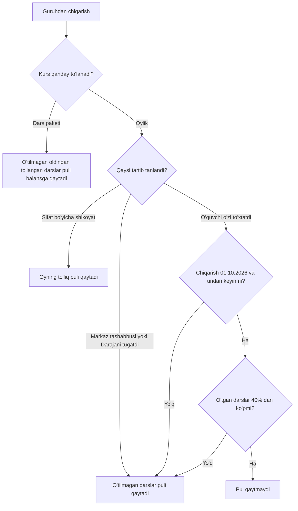

## Nima bo'ladi

Guruhdan chiqarish o'quvchini bitta guruhdan chiqaradi. O'quvchining holati o'zgarmaydi: u «Faol» bo'lib qoladi; boshqa faol guruhi bo'lmasa, «Guruhlashtirilmagan» ro'yxatiga tushadi ([O'quvchining hayot davri](/qollanma/oquvchilar/hayot-davri)).

- Yozilish yopiladi va kartadagi «Guruhlar» tabidan yo'qoladi. Chiqarish o'quvchi bilan guruhning tarixiga yoziladi.
- Sabab majburiy.
- O'quvchining puli shu sahifadagi qoida bo'yicha hisoblanadi.

Oynani uch joydan ochasiz: o'quvchi kartasidagi «Guruhlar» tabida guruh kartasidagi «Chiqarish» tugmasi (ustiga olib borsangiz «Guruhdan chiqarish» chiqadi); guruh sahifasidagi «O'quvchilar» tabida qator menyusidagi «Guruhdan chiqarish»; «Aloqa markazi» → «Ko'p dars qoldirganlar» tabidagi «Chiqarish».

## Oyna

Oyna «Guruhdan chiqarish» deb nomlanadi. Unda quyidagilar bor:

1. **Sabab.** «Sababni tanlang» ro'yxati va «Qo'shimcha izoh (ixtiyoriy)» maydoni. Ro'yxat Sozlamalar → «Sabablar» → «Chiqish va status» da yuritiladi. «Boshqa sabab» tanlansa, izoh majburiy (kamida 5 belgi). Sabablar ro'yxati bo'sh bo'lsa, sababni matn bilan yozasiz («Sabab yozing...»).
2. **Pulni qaytarish tartibi.** «Pul (shartnoma bo'yicha)» blokidagi tanlov. «O'quvchi o'zi to'xtatdi» oldindan tanlangan. Har tartib ostida shu oy uchun nima bo'lishi yozilgan. Tartiblar pastda tushuntirilgan.
3. **Oy darslari.** Blokning tepasida bir qator: oy, darslar soni, oyning hisobi va bugungi ulush — masalan, «Oktabr: 12 dars, 1 200 000 so'm. Bugun 09.10, o'tgani: 4 ta (33%)». Uning ostida har dars uchun kvadratcha turadi (dars kunining raqami bilan). To'ldirilgani — o'tgan dars, bo'shi — hali o'tmagan dars: kvadratcha ustiga olib borsangiz «O'tgan dars» yoki «Hali o'tmagan dars» chiqadi. Bugungi kundagi dars ham o'tgan hisoblanadi.
4. **Natija qutisi.** Tanlangan tartib bilan chiqarsangiz balansga nima bo'lishi. Tartibni o'zgartirsangiz, quti ham o'zgaradi. Uning ostida «Shartnoma 6.2 · 01.10.2026 dan chiqqanlarga qo'llanadi» yozuvi turadi. Quti uch xil bo'ladi:
   - yashil: «3 ta o'tilmagan dars puli qaytadi: ... so'm» va balansning o'zgarishi («Balans: ... → ... so'm»). Dars hali o'tmagan bo'lsa — «Hali dars o'tmagan: ... dars puli to'liq qaytadi». «Sifat bo'yicha shikoyat»da — «Oyning to'liq puli qaytadi»;
   - sariq: «Pul qaytmaydi» va «Oy darslarining 42% o'tgan. Qarz o'zgarmaydi: ... so'm.» (yoki «Balans o'zgarmaydi.»);
   - kulrang: «Qaytadigan dars yo'q» va «Oyning hamma darslari o'tgan.»
5. **«Chiqarish» tugmasi.** Oyna pul hisobini yuklamaguncha tugma bosilmaydi: hech kim ko'rmagan summa bilan tasdiqlamasin.

Pul bloki hamma o'quvchida chiqmaydi. U faqat oylik to'lov modelidagi kursda, shu oyning hisobi yozilgan bo'lsa ko'rinadi. Dars paketi kursida blok yo'q: oldindan to'langan, hali o'tilmagan darslar puli (to'langan paytdagi dars narxida) o'zi balansga qaytadi.

## Pulni qaytarish tartiblari

| Tartib | Qachon tanlanadi | Nima qaytadi |
|---|---|---|
| «O'quvchi o'zi to'xtatdi» | O'quvchi o'z qarori bilan to'xtadi. Oldindan tanlangan | Oyning 40% idan ko'pi o'tmagan bo'lsa — o'tilmagan darslar puli. Ko'pi o'tgan bo'lsa — hech narsa (01.10.2026 dan) |
| «Darajani tugatdi» | O'quvchi darajani (A1, A2...) tugatdi: sertifikat olib to'xtaydi yoki keyingi daraja guruhini kutadi | O'tilmagan darslar puli. 40% qoidasi qo'llanmaydi |
| «Markaz tashabbusi» | Chiqarishni markaz qaror qildi | O'tilmagan darslar puli |
| «Sifat bo'yicha shikoyat» | O'quvchining sifat bo'yicha shikoyati asosli | Oyning to'liq puli, o'tgan darslar ham. Ustoz oyligi kamaymaydi |

## 40% qoidasi (shartnoma 6.2)

O'quvchi o'zi to'xtatsa va shu oy darslarining 40% idan ko'pi allaqachon o'tgan bo'lsa, oyning puli qaytmaydi. Aynan 40% yoki kamroq o'tgan bo'lsa, o'tilmagan darslar puli qaytadi.

- **Ulush.** Ketish kunigacha o'tgan darslar ÷ oydagi darslar. Ketish kuni — «Chiqarish» tugmasi bosilgan Toshkent kuni; o'sha kundagi dars ham o'tgan hisoblanadi.
- **40% dan ko'p — qat'iy shart.** Aynan 40% o'tgan bo'lsa, pul qaytadi. Masalan, oyda 10 dars bo'lsa: 4 tasi o'tgan bo'lsa qaytadi, 5 tasi o'tgan bo'lsa qaytmaydi.
- **Dars kuni bo'yicha, davomat bo'yicha emas.** O'quvchi kelmagan dars ham o'tgan hisoblanadi.
- **Oy o'rtasida qo'shilgan o'quvchi.** Faqat uning o'z darslari sanaladi: ulush o'z darslariga nisbatan.
- **Oldin qaytarilgan darslar** (muzlatishda yoki markaz darsni bekor qilganda) ikkala tomondan chiqariladi.
- **Chegara — kompaniya sozlamasi.** 40% Sozlamalar → «To'lov» dagi «Oyning necha foizi o'tgach pul qaytarilmaydi» maydonida turadi. Uni faqat CEO o'zgartiradi. Chegara o'zgarsa, oynadagi matn ham shunga qarab yoziladi.
- **Sana.** Qoida 01.10.2026 va undan keyin chiqarilganlarga qo'llanadi. Undan oldin oynada «Shartnoma 6.2 hali kuchga kirmagan — o'tilmagan darslar puli qaytadi» chiqadi. Oldin chiqarilganlar eski qoidada qoladi.

## Qancha qaytadi

- O'tilmagan har dars uchun bir dars narxi qaytadi. Bir dars narxi — oy narxi ÷ oydagi darslar soni. O'quvchida chegirma bo'lsa, chegirmali narx qaytadi.
- Qaytadigan summa oyning hisobida qolgan puldan oshmaydi (masalan, oldin qisman qaytgan bo'lsa).
- Oynadagi summa — yoziladigan summaning o'zi: oyna ham, yozuv ham bitta hisobdan foydalanadi.

## Pul qayerga tushadi

- Qaytgan pul o'quvchining balansiga tushadi. Naqd berilmaydi: naqd pulni keyin «Pul qaytarish» orqali berasiz ([Pulni qaytarish va yechib olish](/qollanma/tolovlar/pul-qaytarish)).
- Balansda qarz bo'lsa, qaytgan pul avval qarzni kamaytiradi. Natija qutisida «Qarz: ... → ... so'm» yoki «Qarz yopiladi, balansda ... so'm qoladi» deb yoziladi.
- Ustoz oyligiga tegilmaydi: hech bir tartib hisoblangan oylikni kamaytirmaydi. «Sifat bo'yicha shikoyat»da o'quvchiga qaytgan pulning ustozga tegishli qismini markaz qoplaydi: oynada «Ustoz oyligi kamaymaydi, farqni markaz qoplaydi.» deb yoziladi.
- Nima bo'lgani tarixda qoladi. O'quvchi kartasining «Tarix» tabida «Guruhdan chiqarildi» yozuvi, guruhning «Tarix» tabida esa «O'quvchi chiqarildi» yozuvi paydo bo'ladi. Unda «Guruh», «Sabab» va «Pul» qatorlari bor, yozuvni kim qilgani ham ko'rinadi. Masalan, pul qaytmagan bo'lsa: «Shartnoma 6.2: oy darslarining 42% o'tgan (5/12) — oy to'lovi qaytarilmadi» (raqamlar misol uchun).

## Misol

Oylik kurs: oyiga 1 200 000 so'm, oktabrda 12 ta dars, bir dars 100 000 so'm. Oy boshida to'liq hisob yozilgan. Chiqarish 01.10.2026 dan keyin. Ismlar soxta.

**1-holat: Jasur 4-dars kuni chiqdi.** O'tgan darslar: 4 ÷ 12 = 33%. Bu 40% dan ko'p emas, shuning uchun o'tilmagan 8 dars puli qaytadi: 8 × 100 000 = 800 000 so'm. Oyning hisobi 400 000 so'm (4 dars) bo'lib qoladi. Jasurda 10% chegirma bo'lsa, har dars 90 000 so'm bo'ladi va 8 × 90 000 = 720 000 so'm qaytadi.

**2-holat: Nilufar 5-dars kuni chiqdi.** 12 darsning 40% i — 4,8 dars. Nilufarda 5 dars o'tgan, bu 4,8 dan ko'p (5 ÷ 12 = 42%). Natija tanlangan tartibga bog'liq:

| Tartib | Qaytadi | Hisob |
|---|---|---|
| «O'quvchi o'zi to'xtatdi» | 0 so'm | 40% dan ko'p o'tgan: pul qaytmaydi, oyning 1 200 000 so'mi qoladi |
| «Darajani tugatdi» | 700 000 so'm | 7 o'tilmagan dars × 100 000 |
| «Markaz tashabbusi» | 700 000 so'm | 7 o'tilmagan dars × 100 000 |
| «Sifat bo'yicha shikoyat» | 1 200 000 so'm | oyning hamma darsi: 12 × 100 000 |

**3-holat: aynan 40%.** Boshqa kurs: oyiga 1 000 000 so'm, oyda 10 dars, bir dars 100 000 so'm. Ulugbek 4-dars kuni chiqdi: 4 ÷ 10 = 40%. Bu 40% dan ko'p emas, shuning uchun 6 × 100 000 = 600 000 so'm qaytadi. 5-dars kuni chiqsa (50%), pul qaytmaydi.

**4-holat: oy o'rtasida qo'shilgan.** Dilshod 5-dars kuni qo'shildi: uning 8 ta darsi bor (5-dan 12-gacha), hisobi 800 000 so'm. 8-dars kuni chiqdi: o'z 8 darsidan 4 tasi o'tgan, 4 ÷ 8 = 50%. Bu 40% dan ko'p, shuning uchun pul qaytmaydi. (Hamma 12 darsdan hisoblansa 33% chiqardi, lekin ulush uning o'z darslariga nisbatan sanaladi.)

## Istisnolar

40% qoidasi faqat guruhdan chiqarishda va chetlatishda («O'quvchi o'zi to'xtatdi» tartibi) ishlaydi. Boshqa hollarda eski qoida: o'tilmagan darslar puli qaytadi.

- **Muzlatish**, **boshqa guruhga o'tkazish**, guruh yoki filial yopilishi, kurs arxivlanishi va guruhni o'chirish — markaz qarori. 40% qoidasi ularga tegmaydi.
- **Kartani arxivga o'tkazish** — xato yozuvni o'chirish, ketish emas. Unga ham 40% qoidasi qo'llanmaydi.
- **Butun guruh darajani tugatib «Tugallangan» bo'lsa**, o'tilmagan darslar puli qaytadi va o'quvchilar avtomatik «Bitirgan» bo'ladi.
- **Oyning hamma darsi o'tgan** bo'lsa yoki muzlatish qolganini allaqachon qaytargan bo'lsa, qaytadigan pul yo'q. Bunda oynada «Pul qaytmaydi» emas, «Qaytadigan dars yo'q» chiqadi: qoida hech narsani ushlab qolmagan.
- **Chetlatishda** «Darajani tugatdi» tartibi yo'q: darajani tugatgan o'quvchi guruhdan chiqariladi, chetlatilmaydi. [Chetlatish, bitirish, arxiv](/qollanma/oquvchilar/chetlatish-va-arxiv).
- **Qarzdor.** 40% dan keyin ketgan qarzdorning oylik qarzi to'liq qoladi va «Qarzdorlik» sahifasida ko'rinadi. Qarz kechirish alohida: oynadagi «Qarzni hisobdan chiqarish» bloki qarz kechirish yoqilgan va shart bajarilgan bo'lsagina chiqadi. Qarz kechirish boshida o'chiq turadi. Batafsil — [Qarzdorlik](/qollanma/tolovlar/qarzdorlik).
- **Muzlatilgan o'quvchi.** Uning yozilishi kartada ko'rinmagani uchun bu oyna orqali chiqarib bo'lmaydi: «Chiqarish» tugmasi faqat faol yozilishlarda bor.
- **Pul hisobi yuklanmasa**, blok o'rnida «Pul hisobini yuklab bo'lmadi. Oy to'lovi shartnoma qoidasi bo'yicha hisoblanadi.» chiqadi. Chiqarish baribir mumkin: tizim shartnoma qoidasini o'zi qo'llaydi.
- **Tartibni keyin o'zgartirib bo'lmaydi.** Chiqarilgandan keyin tanlangan tartib o'zgarmaydi va ekranda uni tuzatadigan tugma yo'q. Shuning uchun tasdiqlashdan oldin natija qutisidagi summani tekshiring.

## Kim qila oladi

«Ha» — ekranda tanlov bor va tizim uni qabul qiladi. «—» — ekranda yo'q va tizim rad etadi. Filial direktori va administrator faqat o'z filialidagi o'quvchi bilan ishlaydi.

| Amal | CEO | Filial direktori | Administrator |
|---|---|---|---|
| O'quvchini guruhdan chiqarish | Ha | Ha | Ha |
| «O'quvchi o'zi to'xtatdi» va «Darajani tugatdi» tartibini tanlash | Ha | Ha | Ha |
| «Markaz tashabbusi» va «Sifat bo'yicha shikoyat» tartibini tanlash | Ha | Ha | — |
| 40% chegarasini o'zgartirish | Ha | — | — |

Administrator oynada faqat ikki tartibni ko'radi: «O'quvchi o'zi to'xtatdi» va «Darajani tugatdi». Ostida «Markaz tashabbusi yoki sifat shikoyatini faqat direktor yoki CEO tanlaydi» yozuvi turadi. Tizim huquqni har safar bazadan tekshiradi. Roli olib qo'yilgan xodim eski oyna orqali bu tartibni yuborsa, tizim «Pulni boshqa tartibda qaytarishni faqat CEO yoki filial direktori tanlay oladi» deb rad etadi.

## Tizimda qayerda

- [O'quvchi kartasi](/qollanma/oquvchilar/oquvchi-kartasi) → «Guruhlar» tabi → guruh kartasidagi «Chiqarish».
- Guruh sahifasi → «O'quvchilar» tabi → qator menyusidagi «Guruhdan chiqarish».
- [Aloqa markazi](/outreach) → «Ko'p dars qoldirganlar» → «Chiqarish».
- 40% chegarasi: [To'lov sozlamalari](/settings/payment) — Sozlamalar → «To'lov». Menyuda faqat CEO va filial direktoriga ko'rinadi.
- Oylik to'lov qanday hisoblanishi — [Oylik to'lov](/qollanma/tolovlar/oylik-tolov).
