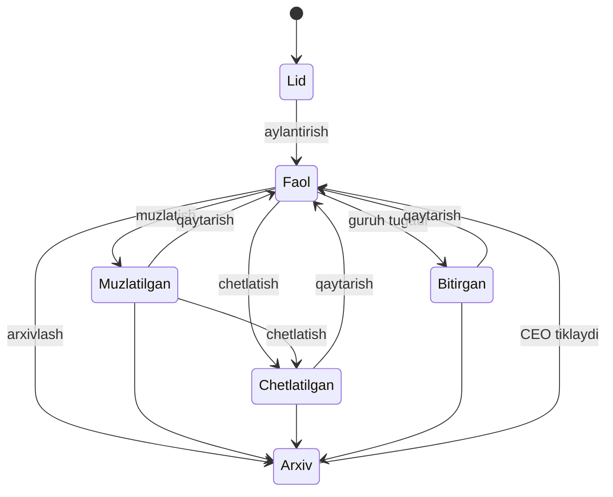

## Holatlar va o'tishlar

O'quvchining holati kartasida va «O'quvchilar» ro'yxatidagi «Holat» ustunida ko'rinadi. Holatni «Status o'zgartirish» amali bilan o'zgartirasiz: u «Statusni o'zgartirish» oynasini ochadi. «Bitirgan» holatini tizim o'zi qo'yadi.

Strelka shu holatdan bunga o'tish mumkinligini bildiradi. «Lid» o'quvchi holati emas: bu «Lidlar» doskasidagi, hali o'quvchi bo'lmagan mijoz.

| Holat | Nimani bildiradi | Qanday bo'ladi |
|---|---|---|
| «Faol» | O'quvchi o'qiydi. Guruhga hali qo'shilmagan bo'lsa ham holati «Faol» bo'ladi | Lid o'quvchiga aylanganda yoki boshqa holatdan qaytarilganda |
| «Muzlatilgan» | O'qishi vaqtincha to'xtagan, keyin qaytadi | «Status o'zgartirish» orqali yoki avtomatik pauzada. Batafsil — [Muzlatish va qaytarish](/qollanma/oquvchilar/muzlatish) |
| «Chetlatilgan» | O'qishni butunlay tashlab ketgan | «Status o'zgartirish» orqali. Batafsil — [Chetlatish, bitirish, arxiv](/qollanma/oquvchilar/chetlatish-va-arxiv) |
| «Bitirgan» | Kursni tugatgan | Guruh «Tugallangan» bo'lganda o'zi. Qo'lda tanlab bo'lmaydi |
| «Arxivlangan» | Xato yoki takroriy yozuv | Arxivga o'tkazilganda. Ro'yxatlardan yo'qoladi |

Qaysi holatdan qayerga o'tish mumkin:

| Hozirgi holat | Qayerga o'tish mumkin |
|---|---|
| «Faol» | «Muzlatilgan», «Chetlatilgan», arxiv. Guruh tugaganda o'zi «Bitirgan» bo'ladi |
| «Muzlatilgan» | «Faol», «Chetlatilgan», arxiv |
| «Chetlatilgan» | «Faol», arxiv |
| «Bitirgan» | «Faol», arxiv |
| Arxiv | «Faol». Buni faqat CEO qiladi |

## Har o'quvchi lid bo'lib boshlanadi

Markaz o'quvchi qayerdan kelganini bilishi uchun har yangi o'quvchi lid yozuvi bilan bog'lanadi. Buni to'rt yo'l ta'minlaydi:

| Yo'l | Lid qanday yoziladi |
|---|---|
| «Lidlar» doskasida «O'quvchiga aylantirish» | Lid allaqachon bor: u «O'quvchiga aylangan» bo'ladi |
| «O'quvchilar» sahifasida «Yangi o'quvchi» | Lid o'zi yoziladi. Manbani «Qayerdan bildi?» maydonida siz tanlaysiz |
| Telegram bot orqali ro'yxatdan o'tish | Lid o'zi yoziladi. Manba — «Telegram bot» |
| Mock imtihon ishtirokchisini «O'quvchiga aylantirish» | Lid o'zi yoziladi. Manba — «Mock imtihon» |

- Telefon raqami mos lid bo'lsa, yangi lid ochilmaydi: o'sha lid o'quvchiga ulanadi. Doskadagi lid ham, yo'qotilgan deb arxivga tushgan lid ham mos keladi. Moslik butun kompaniya bo'yicha qidiriladi.
- Ulangan lidning filiali o'quvchining filialiga tenglashtiriladi: o'quvchi haqiqatda o'qiy boshlagan filialda sanaladi.
- Kartadagi «Lid tarixi» tabida shu lid ko'rinadi: «Telefon», «Manba», «Bo'lim», «Yaratilgan» va «Aylantirilgan» sanalari.
- 10.09.2026 dan oldin kelgan o'quvchilarning ko'pi lidsiz qolgan: ularni orqaga qarab lid bilan bog'lamaslikka CEO qaror qilgan. Bunday o'quvchining «Lid tarixi» tabida «Bu o'quvchi lid orqali kelmagan» yozuvi turadi.
- Doskadan o'tmagan (to'g'ridan kelgan) o'quvchilar voronka foiziga kirmaydi, lekin manba statistikasida sanaladi.

## «Faol o'quvchi» nimani bildiradi

«Faol o'quvchi» — holati «Faol» va hozir «Faol» guruhda o'qiyotgan o'quvchi.

- Shu qoida bilan sanaladi: Bosh sahifadagi «Aktiv o'quvchilar», «O'quvchilar» sahifasidagi «Faol» kartasi va «Faol» filtri, Telegram kunlik hisoboti (10.09.2026 dan).
- Holati «Faol», lekin hozir hech qaysi «Faol» guruhda o'qimayotgan o'quvchi «Guruhlashtirilmagan» ro'yxatiga tushadi. Bunday o'quvchi guruhga hali yozilmagan, guruhi hali «Boshlanmagan» yoki «Pauza» holatida, guruhdan chiqarilgan yoki guruhi tugagan bo'ladi.
- «Faol» va «Guruhlashtirilmagan» ro'yxatlari kesishmaydi: ikkalasi birga holati «Faol» bo'lgan hamma o'quvchini beradi.
- Pul raqamlari boshqacha sanaladi. Masalan, «Qarzdorlar» kartasi balansi manfiy bo'lgan hamma o'quvchini sanaydi — muzlatilgan yoki chetlatilganni ham. Sabab: bunday o'quvchining qarzi ham qarz.

## Misol

Nilufar Instagram orqali yozdi va «Lidlar» doskasiga tushdi.

1. Nilufar ro'yxatdan o'tgani kelganda administrator lid kartochkasida «O'quvchiga aylantirish» ni bosdi va filialni tanladi. Nilufar «Faol» bo'ldi. Guruh tanlanmagani uchun u «Guruhlashtirilmagan» ro'yxatida turdi.
2. Administrator uni «Faol» guruhga qo'shdi. Endi Nilufar «faol o'quvchi».
3. Ikki oydan keyin Nilufar kasal bo'ldi. Administrator uni «Muzlatilgan» qildi: u davomat ro'yxatidan chiqdi.
4. Nilufar sog'ayib qaytdi. Administrator uni «Faol» ga qaytardi va u o'z guruhida davom etdi.
5. Guruh «Tugallangan» bo'ldi. Nilufar avtomatik «Bitirgan» bo'ldi.

## Istisnolar

- «Bitirgan» holatini «Statusni o'zgartirish» oynasidan tanlab bo'lmaydi: uni guruh tugaganda tizim o'zi qo'yadi.
- Guruh tugagan paytda o'quvchi «Muzlatilgan» bo'lsa, u bitirmaydi: guruhdan chiqarilgan hisoblanadi. Batafsil — [Guruh holatlari](/qollanma/guruhlar/guruh-holatlari).
- «Chetlatilgan» yoki «Bitirgan» o'quvchini «Faol» ga qaytarsangiz ham, u eski guruhiga o'zi qaytmaydi: uni guruhga qayta qo'shasiz. Faqat «Muzlatilgan» o'quvchi qaytganda guruhi qaytadi (guruh «Faol» bo'lsa).
- Arxivdan tiklangan o'quvchi «Faol» holatda, guruhsiz qaytadi.
- «Chetlatilgan», «Muzlatilgan» va «Bitirgan» o'quvchining kirish hisobi ochiq qoladi: u qarzini o'quvchi portalida ko'rib to'laydi. Arxivlangan o'quvchining hisobi yopiladi.
- «Ketgan o'quvchi» o'quvchi holati emas, hisobot ta'rifi. Uni [Lug'at](/qollanma/boshlash/lugat) sahifasidan qarang.

## Kim qila oladi

«Ha» — ekranda tugma bor va tizim amalni qabul qiladi. «—» — ekranda yo'q va tizim rad etadi. Filial direktori va administrator faqat o'z filialidagi o'quvchi bilan ishlaydi.

| Amal | CEO | Filial direktori | Administrator |
|---|---|---|---|
| O'quvchi qo'shish, kartani tahrirlash | Ha | Ha | Ha |
| Holatni o'zgartirish: muzlatish, chetlatish, «Faol» ga qaytarish | Ha | Ha | Ha |
| Arxivga o'tkazish | Ha | Ha | Ha |
| Arxivdan tiklash | Ha | — | — |

O'qituvchi va kassir o'quvchi holatini o'zgartira olmaydi.

## Tizimda qayerda

- [O'quvchilar](/students) — ro'yxat. Yuqorida «Jami», «Faol», «Muzlatilgan» va «Qarzdorlar» kartalari, undan keyin qidiruv va «Barcha holatlar» filtri: «Faol», «Muzlatilgan», «Guruhlashtirilmagan», «Bitirgan», «Chetlatilgan».
- Holatni o'zgartirish: o'quvchi kartasida «Status o'zgartirish» belgisi yoki ro'yxatdagi qator menyusidagi «Status o'zgartirish». Qator menyusidagi «Status tarixi» holat o'zgarishlarini ko'rsatadi.
- Yangi o'quvchi — [Yangi o'quvchi](/qollanma/oquvchilar/yangi-oquvchi) sahifasi.
- O'quvchi kartasi — [O'quvchi kartasi](/qollanma/oquvchilar/oquvchi-kartasi) sahifasi.
