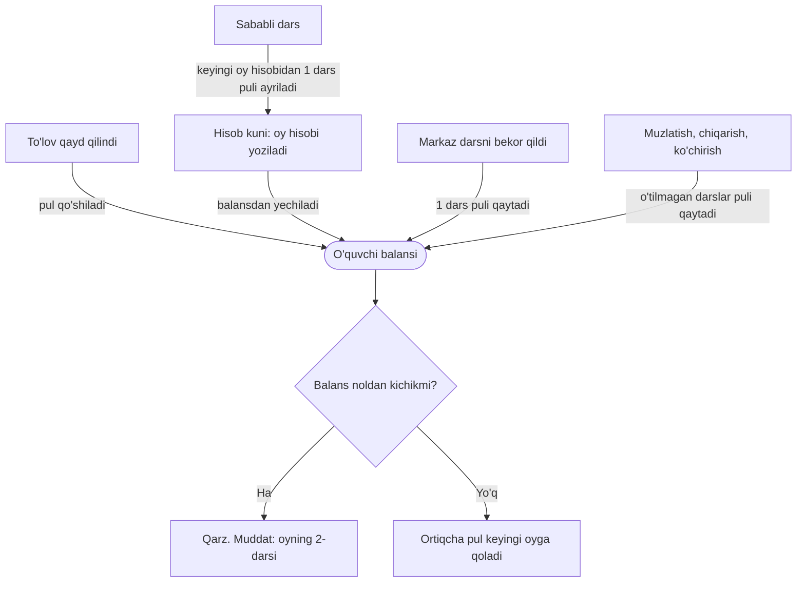

## Qanday ishlaydi

Oylik kursda o'quvchi kalendar oy uchun to'laydi. Oy boshida tizim butun oy hisobini yozadi va balansdan yechadi. Davomat pulga tegmaydi.

1. **Hisob kuni.** Hisob yoziladigan kunni Sozlamalar → «To'lov» dagi «Oyning qaysi kunida oylik hisob-kitob yaratiladi» maydoni belgilaydi: 1 dan 28 gacha son, boshlang'ich qiymati — 1. Tizim hisobni shu kuni tunda, soat 03:10 da yozadi. Hisob kunidan boshlab har tunda, soat 04:00 da, hisobi yozilmay qolgan yozilishlarni tekshiradi va yetishmaganini yozadi. Kunni faqat CEO o'zgartiradi; u butun kompaniya uchun bitta.
2. **Kimga yoziladi.** Kurs oylik bo'lsa, guruh «Faol» bo'lsa, o'quvchining holati «Faol» va yozilishi faol bo'lsa. Oyda guruhning kamida bitta dars kuni bo'lishi kerak. Muzlatilgan, chetlatilgan yoki bitirgan o'quvchiga hisob yozilmaydi; «Boshlanmagan» yoki «Pauza» holatidagi guruhga ham.
3. **Balansdan yechiladi.** O'quvchi to'lay oladimi-yo'qmi, hisob baribir yoziladi: balans yetmasa u minusga tushadi va o'quvchi qarzdor bo'ladi. Kartadagi «To'lovlar» tabida, «Batafsil» → «Barcha yozuvlar» da hisob «Darsga yechildi» belgisi va «Oktabr 2026 oylik to'lovi» kabi izoh bilan turadi.
4. **Muddat.** Shartnoma bo'yicha oylik to'lov oyning 2-darsigacha qilinadi. 2-dars — o'quvchining shu oydagi birinchi darsidan sanalgan ikkinchi dars, guruhning haqiqiy jadvali bo'yicha (bekor qilingan yoki ko'chirilgan dars hisobga olinadi).
5. **Davomat pulga tegmaydi.** Dars puli oy boshida to'langan. Davomat ikki narsani hal qiladi: ustoz oyligi va sababli darsning keyingi oyga krediti. «Kelmadi» oy puliga ta'sir qilmaydi.

### Summa qanday chiqadi

- **To'liq oy** — aynan «Oylik narx»: yaxlitlash uni siljitmaydi. Chegirma va kredit shu narxdan ayiriladi.
- **Oy o'rtasida qo'shilgan o'quvchi** — oy narxi × o'quvchining darslari ÷ oydagi hamma darslar, so'mgacha yaxlitlanadi. Hisob qo'shilgan zahoti yoziladi: [Guruhga qo'shish va o'tkazish](/qollanma/oquvchilar/guruhga-qoshish).
- **Oydagi darslar soni** — guruhning shu oydagi dars kunlari. Bayram va bekor qilingan darslar hisobga kirmaydi; ko'chirilgan dars yangi kuni bilan sanaladi.
- **Chegirma** — hisob yozilayotgan paytdagi chegirma qo'llanadi va hisobning o'ziga yozib qo'yiladi. Keyin chegirma o'zgartirilsa, yozilgan hisob qayta hisoblanmaydi. Batafsil — [O'quvchi kartasi](/qollanma/oquvchilar/oquvchi-kartasi).
- **Sababli darslar krediti** shu summadan ayiriladi (pastda).

## Pul oy davomida qanday harakatlanadi

O'quvchining balansi bitta hamyon kabi: unga pul kelib tushadi, undan oy hisobi yechiladi. Balans noldan kichik bo'lsa — bu qarz.

To'lov avval eng eski qarzni yopadi, qolgani balansda turadi. Shuning uchun oldindan to'langan pul keyingi oy hisobidan yechiladi.

## Oy davomida balansga tegadigan holatlar

### Sababli darslar

- O'quvchi «Sababli» deb belgilangan har dars uchun keyingi oy hisobidan bir dars puli ayiriladi (kredit).
- Kredit bir dars narxida (chegirma bo'lsa, chegirmali narxda) va butun dars birligida ayiriladi. Hisob kreditni to'liq sig'dira olmasa, sig'magani keyingi oyga suriladi.
- «Sababli» ni keyin boshqa holatga o'zgartirsangiz, kredit qaytarib olinadi.
- Sozlamalar → «To'lov» da: «Sababli darsning krediti keyingi oyga o'tsin» (boshlang'ich holati — yoqilgan). O'chirilsa, sababli dars ham oddiy dars kabi hisoblanadi. «Oyiga eng ko'p nechta kredit dars o'tkazilishi mumkin» maydoni bo'sh bo'lsa — cheklov yo'q; cheklovdan oshgan qism keyingi oyga suriladi.
- Kartadagi «To'lovlar» tabida oy qatorini bossangiz, kredit «o'tgan oydagi uzrli ... dars uchun −... so'm» deb yoziladi.

### Bekor qilingan dars

29.09.2026 dan markaz darsni bekor qilsa, shu kunni qoplagan har bir oy hisobi bir dars puli qaytaradi:

- O'quvchi o'sha kuni davomatda belgilanganmi-yo'qmi, farqi yo'q.
- Pul balansga shu zahoti tushadi: «Barcha yozuvlar» da «Tuzatish» belgisi bilan. Summa — chegirmali dars narxi (oy hisobidagi dars narxi bo'yicha); hisobda qolgan puldan oshmaydi.
- Bekor qilingan kun endi hisobga kirmaydi: ustoz ham shu dars uchun haq olmaydi.
- Guruhdan chiqqan yoki boshqa guruhga o'tgan o'quvchiga ham pul qaytadi.
- Bir kunni takror bekor qilish ikkinchi marta pul bermaydi. Muzlatishdan qaytganda bekor qilingan kun hisoblanmaydi.
- Shu kuni «Sababli» bo'lgan o'quvchi keyingi oyda kredit olmaydi: pul allaqachon qaytgan.
- Bekor qilish yozuvini o'chirsangiz, qaytgan pul qayta yechilmaydi.

Darsni guruh sahifasidagi «Dars o'zgarishlari» tabida, «Darsni bekor qilish» oynasida bekor qilasiz.

### Muzlatish, chiqarish, ko'chirish

- **Muzlatish.** Oyning o'tilmagan darslari puli balansga qaytadi; muzlatilgan kunning o'zi o'tilgan hisoblanadi. Qaytganda faqat qaytgan kundan keyingi darslar hisoblanadi: [Muzlatish va qaytarish](/qollanma/oquvchilar/muzlatish).
- **Guruhdan chiqarish.** Tanlangan tartibga qarab o'tilmagan darslar puli qaytadi. O'quvchi o'zi ketsa va oyning 40% idan ko'pi o'tgan bo'lsa (01.10.2026 dan) pul qaytmaydi: [Guruhdan chiqarish](/qollanma/oquvchilar/guruhdan-chiqarish).
- **Boshqa guruhga o'tkazish.** Eski oy hisobi o'tkazish kunigacha o'tilgan darslarga qisqaradi; yangi kurs qolgan darslar uchun o'z narxida olinadi.

Bu holatlarda pul naqd berilmaydi: u balansga tushadi. Naqd berish — [Pulni qaytarish va yechib olish](/qollanma/tolovlar/pul-qaytarish).

### Telegram xabarlari

Har kuni soat 19:50 da tizim ikki xabarni navbatga qo'yadi, soat 20:00 da esa o'quvchiga Telegram bot orqali yuboradi:

- **Oy hisobi** — hisob yozilgan kuni. Unda guruh nomi va dars kunlari, oy narxi va darslar soni, sababli darslar uchun chegirma (bo'lsa), «Jami to'lash kerak» va «Muddat» turadi. Balans yetarli bo'lsa, xabar «Qolgan balans» ni ko'rsatib, to'lov qilish shart emasligini yozadi.
- **To'lov eslatmasi** — qarzdor o'quvchiga, oydagi 2-darsidan bir kun oldin kechqurun.

Qoidalar:

- Xabar 20:00 da jonli balansdan yoziladi. Shu kuni to'lagan o'quvchiga eslatma ketmaydi; hisobi bekor qilingan yoki guruhdan chiqqan, muzlatilgan o'quvchiga hisob xabari ketmaydi.
- Oy hisobi haqida o'quvchining shu oydagi birinchi hisobi uchungina xabar ketadi. Oy o'rtasida guruhi almashtirilgan o'quvchining ikkinchi hisobi haqida xabar ketmaydi. 0 so'mlik hisob haqida ham ketmaydi.
- 19:50 dan keyin yozilgan hisob (kechki qo'shilish) haqidagi xabar ertasi kuni ketadi.
- Telegram bog'lanmagan o'quvchiga hech narsa ketmaydi. Yuborilgan xabar kartadagi «SMS» tabida ko'rinadi.
- Matnlarni CEO 27.09.2026 da tasdiqlagan. Xabarlarni Sozlamalar → «To'lov» dagi «O'quvchiga oylik to'lov xabari» o'chiradi (faqat CEO; boshlang'ich holati — yoqilgan). O'chiq paytda yozilgan hisoblar xabarsiz qoladi: qayta yoqilganda eski hisoblar yuborilmaydi.

## Misol

Oylik kurs: oyiga 1 200 000 so'm, oktabrda ham, noyabrda ham 12 ta dars, bir dars 100 000 so'm. Hisob kuni — 1. Ism soxta.

1. **01.10.** Jasurning balansi 0. Hisob yoziladi: balans −1 200 000 so'm. Telegram bog'langan bo'lsa, kechqurun «Jami to'lash kerak: 1 200 000 so'm» xabari keladi.
2. **02.10.** 2-darsdan oldin Jasur 1 500 000 so'm to'ladi. Qarz yopildi, 300 000 so'm balansda qoldi.
3. **Oktabr davomida.** Jasur bitta darsga «Sababli», ikkita darsga «Kelmadi» deb belgilandi. Kelmagan darslar oy puliga tegmaydi. Sababli dars uchun noyabr hisobidan 100 000 so'm ayiriladi.
4. **15.10.** Markaz bitta darsni bekor qildi: Jasurga 100 000 so'm shu zahoti qaytdi, balans 400 000 so'm.
5. **01.11.** Noyabr hisobi: 1 200 000 − 100 000 (sababli dars krediti) = 1 100 000 so'm. Balans 400 000 − 1 100 000 = −700 000 so'm: Jasur 700 000 so'm qarzdor. Telegram bog'langan bo'lsa, xabarda «Jami to'lash kerak: 700 000 so'm» turadi.

## Istisnolar

- Hisob yozilgandan keyin qo'shilgan bayram yoki darsning ko'chirilishi yozilgan hisob summasini o'zgartirmaydi. Bekor qilingan dars esa yuqoridagi qoida bo'yicha pul qaytaradi.
- «Sababli» belgilanayotgan oyning hisobi hali yozilmagan bo'lsa, kredit yozilmaydi. Hisob kuni oyning 1-sanasidan keyin bo'lsa, shunday bo'lishi mumkin.
- Hisob kuni 1 dan katta bo'lsa, hisobdan oldin tushgan 2-dars uchun eslatma ketmaydi va hisob xabarida «Muddat» qatori chiqmaydi.
- Guruh «Boshlanmagan» yoki «Pauza» holatida bo'lsa, oylik hisob yozilmaydi; guruh «Faol» bo'lgach tizim uni o'zi yozadi.
- Yozilgan oy hisobini ekrandan bekor qilib bo'lmaydi: bunday tugma yo'q.

## Kim qila oladi

«Ha» — ekranda tugma bor va tizim amalni qabul qiladi. «—» — ekranda yo'q yoki tizim rad etadi. Filial direktori va administrator faqat o'z filialida ishlaydi.

| Amal | CEO | Filial direktori | Administrator | Kassir |
|---|---|---|---|---|
| Oy hisobini ko'rish (o'quvchi kartasi → «To'lovlar») | Ha | Ha | Ha | — |
| Qarzni ko'rish («Qarzdorlik») | Ha | Ha | Ha | Ha |
| Darsni bekor qilish (pul shu zahoti qaytadi) | Ha | Ha | Ha | — |
| Hisob kunini o'zgartirish | Ha | — | — | — |
| Sababli dars kreditini yoqish yoki o'chirish | Ha | Ha, faqat o'z filiali uchun | — | — |
| Oylik to'lov xabarini yoqish yoki o'chirish | Ha | — | — | — |
| Yozilgan oy hisobini bekor qilish | — | — | — | — |

Filial direktori sozlamalarni ko'radi, lekin hisob kunini va xabarlarni o'zgartira olmaydi: ular butun kompaniya uchun bitta.

## Tizimda qayerda

- [To'lov sozlamalari](/settings/payment) — Sozlamalar → «To'lov». Menyuda faqat CEO va filial direktoriga ko'rinadi.
- [O'quvchi kartasi](/qollanma/oquvchilar/oquvchi-kartasi) → «To'lovlar» tabi → «Oylar bo'yicha»: oy hisobi va uning tafsiloti.
- Guruh sahifasi → «Dars o'zgarishlari» tabi: darsni bekor qilish.
- [Qarzdorlik](/qollanma/tolovlar/qarzdorlik) — hisob to'lanmasa, qarz shu yerda ko'rinadi.
- Oylik va dars paketi farqi — [Kurs qanday to'lanadi](/qollanma/tolovlar/tolov-turlari).
