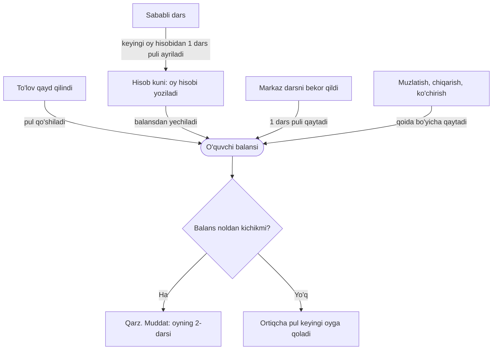

## Qanday ishlaydi

Oylik kursda o'quvchi kalendar oy uchun to'laydi. Oy boshida tizim butun oy hisobini yozadi va balansdan yechadi. Davomat pulga tegmaydi.

1. **Hisob kuni.** Hisob yoziladigan kunni Sozlamalar → «To'lov» dagi «Oyning qaysi kunida oylik hisob-kitob yaratiladi» maydoni belgilaydi: 1 dan 28 gacha son, boshlang'ich qiymati — 1. Tizim hisobni shu kuni tunda, soat 03:10 da yozadi. Hisob kunidan boshlab har tunda, soat 04:00 da, hisobi yozilmay qolgan yozilishlarni tekshiradi va yetishmaganini yozadi. Kunni faqat CEO o'zgartiradi (sozlama sahifasida u «markaz rahbari» deb yoziladi); u butun kompaniya uchun bitta.
2. **Kimga yoziladi.** Kurs oylik bo'lsa, guruh «Faol» bo'lsa, o'quvchining holati «Faol» va yozilishi faol bo'lsa. Oyda guruhning kamida bitta dars kuni bo'lishi kerak. Muzlatilgan, chetlatilgan yoki bitirgan o'quvchiga hisob yozilmaydi; «Boshlanmagan» yoki «Pauza» holatidagi guruhga ham. Guruh «Faol» bo'lgach tizim hisobni o'zi yozadi.
3. **Balansdan yechiladi.** O'quvchi to'lay oladimi-yo'qmi, hisob baribir yoziladi: balans yetmasa u minusga tushadi va o'quvchi qarzdor bo'ladi. Kartadagi «To'lovlar» tabida, «Batafsil» → «Barcha yozuvlar» da hisob «Darsga yechildi» belgisi va «Oktabr 2026 oylik to'lovi» kabi izoh bilan turadi.
4. **Muddat.** Shartnoma bo'yicha oylik to'lov oyning 2-darsigacha qilinadi. 2-dars — o'quvchining shu oydagi birinchi darsidan sanalgan ikkinchi dars, guruhning haqiqiy jadvali bo'yicha (bekor qilingan yoki ko'chirilgan dars hisobga olinadi). 01.10.2026 dan o'quvchi 2-darsdan boshlab faqat puli yetgan darslargacha qatnashadi; to'lamagani darsga qo'yilmaydi (CEO qoidani o'chira oladi): [To'lamagan o'quvchi](/qollanma/davomat/darsga-qoyish).
5. **Davomat pulga tegmaydi.** Dars puli oy boshida to'langan. Davomat ikki narsani hal qiladi: ustoz oyligi va sababli darsning keyingi oyga krediti. «Kelmadi» oy puliga ta'sir qilmaydi. Dars tugaguncha davomat olinmasa va u keyin «Bo'ldi» bilan kiritilsa, ustozga bu dars uchun haq yozilmaydi; o'quvchining puli o'zgarmaydi: [Dars bo'ldimi?](/qollanma/davomat/dars-boldimi).

### Summa qanday chiqadi

- **To'liq oy** — aynan «Oylik narx»: yaxlitlash uni siljitmaydi. Chegirma va kredit shu narxdan ayiriladi.
- **Oy o'rtasida qo'shilgan o'quvchi** — oy narxi × o'quvchining darslari ÷ oydagi hamma darslar, so'mgacha yaxlitlanadi. Hisob qo'shilgan zahoti yoziladi, qo'shish oynasi summani oldindan ko'rsatadi: [Guruhga qo'shish va o'tkazish](/qollanma/oquvchilar/guruhga-qoshish).
- **Oydagi darslar soni** — guruhning shu oydagi dars kunlari. Bayram va bekor qilingan darslar hisobga kirmaydi; ko'chirilgan dars yangi kuni bilan sanaladi.
- **Chegirma** — hisob yozilayotgan paytdagi chegirma qo'llanadi va hisobning o'ziga yozib qo'yiladi. Keyin chegirma o'zgartirilsa, yozilgan hisob qayta hisoblanmaydi. Batafsil — [O'quvchi kartasi](/qollanma/oquvchilar/oquvchi-kartasi).
- **Sababli darslar krediti** shu summadan ayiriladi (pastda).

## Pul oy davomida qanday harakatlanadi

O'quvchining balansi bitta hamyon kabi: unga pul kelib tushadi, undan oy hisobi yechiladi. Balans noldan kichik bo'lsa — bu qarz.

To'lov avval eng eski qarzni yopadi, qolgani balansda turadi. Shuning uchun oldindan to'langan pul keyingi oy hisobidan yechiladi.

## Oyning raqami: hisoblandi, to'landi, qoldi

01.09.2026 dan oyning asosiy raqami — shu oy uchun yozilgan hisob. U uchta joyda turadi:

- Moliya → «Umumiy ma'lumotlar» dagi oy nomli karta («Oktabr to'lovlari» kabi): «Hisoblandi», «To'landi» (foizi bilan) va «Qoldi». Kartani CEO va filial direktori ko'radi. «Tushumlar» kartasini bossangiz ochiladigan oynada ham (bitta oy tanlangan bo'lsa) xuddi shu raqamlar turadi.
- Bosh sahifadagi «Bu oy hisoblandi» kartasi (CEO va filial direktori): ostida «to'landi N%» yoziladi, oyga hech narsa hisoblanmagan bo'lsa — «hisob yozilmagan».
- Telegram guruhidagi 21:00 hisoboti: «Bu oy hisoblandi», «To'landi», «Qoldi» qatorlari.

Raqamlar shunday chiqadi:

- «Hisoblandi» — shu oy uchun o'quvchilarga yozilgan oylik hisoblar yig'indisi: chegirmalar bilan, ketish va bekor qilingan darslar uchun qaytarilgani ayirilgan.
- «Qoldi» — shu hisoblardan hali to'lanmagan qismi. To'lov avval eng eski qarzni yopadi, shuning uchun o'quvchining bugungi qarzi eng yangi hisoblarda turadi deb sanaladi: oyning «Qoldi»si — o'quvchi qarzidan keyingi oylar hisobi chiqarilgach qolgan qism, lekin shu oyning hisobidan ko'p emas.
- «To'landi» — «Hisoblandi» minus «Qoldi». U o'quvchi balansidan chiqariladi, kassadan emas: pulsiz yopilgan hisob (masalan, kechirilgan qarz) ham shunda sanaladi. Shuning uchun «To'landi» shu oy kassaga kirgan pulga («Bu oy tushum») teng bo'lishi shart emas.
- Foiz — «To'landi» ÷ «Hisoblandi»; hech narsa hisoblanmagan oyda foiz chiqmaydi.
- 01.09.2026 dan oldingi oylarda bu kartada «Oy oxiriga kutilyapti» turadi: oy darslarining qiymati, kassaga keladigan pul emas.

## Oy davomida balansga tegadigan holatlar

### Sababli darslar

- O'quvchi «Sababli» deb belgilangan har dars uchun keyingi oy hisobidan bir dars puli ayiriladi (kredit).
- Kredit bir dars narxida (chegirma bo'lsa, chegirmali narxda) va butun dars birligida ayiriladi. Hisob kreditni to'liq sig'dira olmasa, sig'magani keyingi oyga suriladi.
- «Sababli» ni keyin boshqa holatga o'zgartirsangiz, kredit faqat keyingi oy hisobi hali yozilmagan bo'lsa qaytarib olinadi. Kredit keyingi oy hisobi yozilayotganda bir marta o'qiladi; yozilgan hisob esa qayta hisoblanmaydi. Shuning uchun undan ayirilgan kredit o'zgarishsiz qoladi, hisob yozilgandan keyin belgilangan «Sababli» esa unga kirmaydi.
- Sozlamalar → «To'lov» da: «Sababli darsning krediti keyingi oyga o'tsin» (boshlang'ich holati — yoqilgan). O'chirilsa, sababli dars ham oddiy dars kabi hisoblanadi. «Oyiga eng ko'p nechta kredit dars o'tkazilishi mumkin» maydoni bo'sh bo'lsa — cheklov yo'q; cheklovdan oshgan qism keyingi oyga suriladi.
- Kartadagi «To'lovlar» tabida, «Oylar bo'yicha» jadvalidagi oy qatorining «Darslar» ustunida kredit «o'tgan oydagi uzrli ... dars uchun −... so'm» deb yoziladi.

### Bekor qilingan dars

29.09.2026 dan markaz darsni bekor qilsa, shu kunni qoplagan har bir oy hisobi bir dars puli qaytaradi:

- O'quvchi o'sha kuni davomatda belgilanganmi-yo'qmi, farqi yo'q.
- Pul balansga shu zahoti tushadi: «Barcha yozuvlar» da «Tuzatish» belgisi bilan. Summa — chegirmali dars narxi (oy hisobidagi dars narxi bo'yicha); hisobda qolgan puldan oshmaydi.
- Bekor qilingan kun endi hisobga kirmaydi: ustoz ham shu dars uchun haq olmaydi.
- Guruhdan chiqqan yoki boshqa guruhga o'tgan o'quvchiga ham pul qaytadi.
- Bir kunni takror bekor qilish ikkinchi marta pul bermaydi. Muzlatishdan qaytganda bekor qilingan kun hisoblanmaydi.
- Shu kuni «Sababli» bo'lgan o'quvchi keyingi oyda kredit olmaydi: pul allaqachon qaytgan.

Darsni guruh sahifasidagi «Dars o'zgarishlari» tabida, «Darsni bekor qilish» oynasida bekor qilasiz.

**Bekor qilish yozuvini o'chirsangiz** (faqat CEO va filial direktori), qaytgan pul o'quvchilardan qayta yechiladi: kun yana oy hisobiga kiradi, keyingi oy krediti olingan bo'lsa u ham qaytariladi. Oyna shuni aytadi, tugagach esa «... o'quvchidan ... so'm qayta yechildi» xabari chiqadi.

- Davomat va ustoz haqi tiklanmaydi. Dars vaqti o'tib ketgan bo'lsa, u yana «Dars bo'ldimi?» savoliga qaytadi: «Bo'ldi» desa pul yechilgan holda qoladi, «Bo'lmadi» deb yana bekor qilsa pul qaytadi ([Dars bo'ldimi?](/qollanma/davomat/dars-boldimi)).
- Qayta yechilgan pul o'quvchining balansini kamaytiradi va uni qarzdor qilib qo'yishi mumkin.
- Bekor qilingandan beri o'quvchi muzlatilgan, guruhdan chiqqan yoki ko'chgan bo'lsa (yoki uning hisobi o'zgargan bo'lsa), puli qaytarib olinmaydi: bunday o'quvchi xabarda «... o'quvchida qoldi» deb sanaladi. Uni qo'lda ko'rib chiqish kerak.

### Muzlatish, chiqarish, ko'chirish

- **Muzlatish.** Oyning o'tilmagan darslari puli balansga qaytadi; muzlatilgan kunning o'zi o'tilgan hisoblanadi. Qaytganda faqat qaytgan kundan keyingi darslar hisoblanadi: [Muzlatish va qaytarish](/qollanma/oquvchilar/muzlatish).
- **Guruhdan chiqarish.** Tanlangan tartibga qarab o'tilmagan darslar puli qaytadi. O'quvchi o'zi ketsa va oyning 40% idan ko'pi o'tgan bo'lsa (01.10.2026 dan) pul qaytmaydi; hamma guruhda ko'pi bilan 1 ta darsga kelgan o'quvchiga esa (sinov darsi) oyning to'liq puli qaytadi: [Guruhdan chiqarish](/qollanma/oquvchilar/guruhdan-chiqarish).
- **Boshqa guruhga o'tkazish.** Eski oy hisobi o'tkazish kunigacha o'tilgan darslarga qisqaradi; yangi kurs qolgan darslar uchun o'z narxida olinadi.

Bu holatlarda pul naqd berilmaydi: u balansga tushadi. Naqd berish — [Pulni qaytarish va yechib olish](/qollanma/tolovlar/pul-qaytarish).

### Qarzdorning 1-darsi

01.10.2026 dan o'quvchining shu guruhdagi oydagi o'z 1-darsida «Kelmadi» bo'lsa va uning puli bu darsga yetmasa, ustozga haq yozilmaydi: o'quvchi to'lab, puli darsga yetgach yoziladi. «Keldi» yoki «Kechikdi» bo'lsa, haq to'lovga qaramay darrov yoziladi. Batafsil — [Davomat olish](/qollanma/davomat/davomat-olish).

### Telegram xabarlari

Har kuni soat 19:50 da tizim oylik to'lovga oid yozuvlarni o'quvchining kunlik xabari navbatiga qo'yadi. Soat 20:00 da o'quvchiga bitta kunlik xabar bo'lib Telegram bot orqali ketadi; unda oylik to'lovga oid ikki bo'lim bo'ladi:

- **«... oyi uchun to'lov»** (oy hisobi) — hisob yozilgan kuni. Unda guruh nomi va dars kunlari, oy narxi va darslar soni, sababli darslar uchun chegirma (bo'lsa), «Jami to'lash kerak» va «Muddat» turadi. Balans yetarli bo'lsa, bo'lim «Qolgan balans» ni ko'rsatib, to'lov qilish shart emasligini yozadi.
- **«To'lov eslatmasi»** — qarzdor o'quvchiga, oydagi 2-darsidan bir kun oldin kechqurun.

Kunlik xabarda boshqa bo'limlar ham bo'lishi mumkin (masalan, qabul qilingan to'lov).

Qoidalar:

- Xabar 20:00 da jonli balansdan yoziladi: shu kuni to'lagan o'quvchiga eslatma qo'shilmaydi; hisobi bekor qilingan yoki guruhdan chiqqan, muzlatilgan o'quvchiga hisob bo'limi qo'shilmaydi. 19:50 dan keyin yozilgan hisob (kechki qo'shilish) ertasi kunning xabariga tushadi.
- Oy hisobi haqida faqat o'quvchining shu oydagi birinchi hisobi uchun xabar ketadi: oy o'rtasida guruhi almashtirilgan o'quvchining ikkinchi hisobi haqida ham, 0 so'mlik hisob haqida ham ketmaydi.
- Telegram bog'lanmagan o'quvchiga hech narsa ketmaydi; yuborilgan xabar kartadagi «SMS» tabida ko'rinadi. Xabarlarni Sozlamalar → «To'lov» dagi «O'quvchiga oylik to'lov xabari» o'chiradi (faqat CEO; boshlang'ich holati — yoqilgan). O'chiq paytda yozilgan hisoblar xabarsiz qoladi: qayta yoqilganda eski hisoblar yuborilmaydi.

## Misol

Oylik kurs: oyiga 1 200 000 so'm, oktabrda ham, noyabrda ham 12 ta dars, bir dars 100 000 so'm. Hisob kuni — 1. Ism soxta.

1. **01.10.** Jasurning balansi 0. Hisob yoziladi: balans −1 200 000 so'm. Telegram bog'langan bo'lsa, kechqurun «Jami to'lash kerak: 1 200 000 so'm» xabari keladi.
2. **02.10.** 2-darsdan oldin Jasur 1 500 000 so'm to'ladi. Qarz yopildi, 300 000 so'm balansda qoldi.
3. **Oktabr davomida.** Jasur bitta darsga «Sababli», ikkita darsga «Kelmadi» deb belgilandi. Kelmagan darslar oy puliga tegmaydi. Sababli dars uchun noyabr hisobidan 100 000 so'm ayiriladi.
4. **15.10.** Markaz bitta darsni bekor qildi: Jasurga 100 000 so'm shu zahoti qaytdi, balans 400 000 so'm.
5. **01.11.** Noyabr hisobi: 1 200 000 − 100 000 (sababli dars krediti) = 1 100 000 so'm. Balans 400 000 − 1 100 000 = −700 000 so'm: Jasur 700 000 so'm qarzdor. Telegram bog'langan bo'lsa, xabarda «Jami to'lash kerak: 700 000 so'm» turadi.

## Istisnolar

- Hisob yozilgandan keyin qo'shilgan bayram yoki darsning ko'chirilishi yozilgan hisob summasini o'zgartirmaydi. Bekor qilingan dars esa yuqoridagi qoida bo'yicha pul qaytaradi; «Dars bo'ldimi?» savoliga «Bo'lmadi» deb bekor qilish ham shunday. Darsni boshqa kunga ko'chirish esa pul qaytarmaydi.
- «Sababli» belgilanayotgan oyning hisobi hali yozilmagan bo'lsa, kredit yozilmaydi. Hisob kuni oyning 1-sanasidan keyin bo'lsa, shunday bo'lishi mumkin.
- Hisob kuni 1 dan katta bo'lsa, hisobdan oldin tushgan 2-dars uchun eslatma ketmaydi va hisob xabarida «Muddat» qatori chiqmaydi.
- Yozilgan oy hisobini ekrandan bekor qilib bo'lmaydi: bunday tugma yo'q.

## Kim qila oladi

«Ha» — ekranda tugma bor va tizim amalni qabul qiladi. «—» — ekranda yo'q yoki tizim rad etadi. Filial direktori va administrator faqat o'z filialida ishlaydi.

| Amal | CEO | Filial direktori | Administrator | Kassir |
|---|---|---|---|---|
| Oy hisobini ko'rish (o'quvchi kartasi → «To'lovlar») | Ha | Ha | Ha | — |
| Qarzni ko'rish («Qarzdorlik») | Ha | Ha | Ha | Ha |
| Darsni bekor qilish (pul shu zahoti qaytadi) | Ha | Ha | Ha | — |
| Bekor qilish yozuvini o'chirish (pul qayta yechiladi) | Ha | Ha | — | — |
| Hisob kunini o'zgartirish | Ha | — | — | — |
| Sababli dars kreditini yoqish yoki o'chirish | Ha | Ha, faqat o'z filiali uchun | — | — |
| Oylik to'lov xabarini yoqish yoki o'chirish | Ha | — | — | — |
| Yozilgan oy hisobini bekor qilish | — | — | — | — |

Filial direktori sozlamalarni ko'radi, lekin hisob kunini va xabarlarni o'zgartira olmaydi: ular butun kompaniya uchun bitta. Sababli dars krediti esa filial bo'yicha ham saqlanadi: filial direktori o'z filialiga yozgan qiymat kompaniya qiymatidan ustun turadi, shuning uchun CEO kompaniya qiymatini o'zgartirsa ham, o'sha filialga yetib bormasligi mumkin. CEO bunday filiallarni sozlama ostidagi «Filiallarda boshqacha qiymat saqlangan: ...» izohidan ko'radi.

## Tizimda qayerda

- [To'lov sozlamalari](/settings/payment) — Sozlamalar → «To'lov». Menyuda faqat CEO va filial direktoriga ko'rinadi.
- [O'quvchi kartasi](/qollanma/oquvchilar/oquvchi-kartasi) → «To'lovlar» tabi → «Oylar bo'yicha»: oy hisobi va uning tafsiloti.
- Guruh sahifasi → «Dars o'zgarishlari» tabi: darsni bekor qilish va uning yozuvini o'chirish.
- Moliya → [Umumiy ma'lumotlar](/payments/overview): oy nomli karta («Hisoblandi», «To'landi», «Qoldi»); uni CEO va filial direktori ko'radi.
- [Qarzdorlik](/qollanma/tolovlar/qarzdorlik) — hisob to'lanmasa, qarz shu yerda ko'rinadi.
- Oylik va dars paketi farqi — [Kurs qanday to'lanadi](/qollanma/tolovlar/tolov-turlari).
